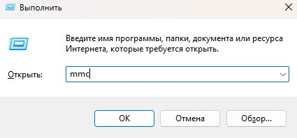

## Содержание

- [Создание группы пользователей](#создание-группы-пользователей)
    - [Открытие оснастки "Локальные пользователи и группы"](#открытие-оснастки-локальные-пользователи-и-группы)
    - [Создание группы](#создание-группы)
- [Создание новой учётной записи и добавление пользователя в группу](#создание-новой-учётной-записи-и-добавление-пользователя-в-группу)
    - [Создание учётной записи](#создание-учётной-записи)
    - [Добавление пользователя в группу](#добавление-пользователя-в-группу)
- [Настройка учётной записи](#настройка-учётной-записи)
    - [Открытие "Локальной политики безопасности"](#открытие-локальной-политики-безопасности)
    - [Настройка параметров пароля](#настройка-параметров-пароля)
    - [Настройка блокировки учётной записи](#настройка-блокировки-учётной-записи)
    - [Настройка прав пользователя](#настройка-прав-пользователя)
- [Настройка консоли](#настройка-консоли)
    - [Открытие корня консоли](#открытие-корня-консоли)
    - [Добавление "Редактора объекта групповой политики" и "Результирующая политика"](#добавление-редактора-объекта-групповой-политики-и-результирующая-политика)
    - [Настройка режима работы консоли](#настройка-режима-работы-консоли)

## Создание группы пользователей

### Открытие оснастки "Локальные пользователи и группы"
Чтобы создать новую группу пользователей в оснастке "Локальные пользователи и группы" в Windows 11 нужно:

1) Сочетанием клавиш `Win + R` открыть диалоговое окно.

2) Ввести `lusrmgr.msc`.

3) Нажать `Enter`.  

  

Далее откроется оснастка "Локальные пользователи и группы". Чтобы создать группу нужно: 

### Создание группы 

1) В левой панели раскрыть вкладку **"Группы"**.

2) Правой кнопкой мыши необходимо нажать на пустом месте в появившемся списке групп.

3) В появившемся окне выбрать **"Создать группу"**.

  

4) В поле **"Имя группы"** ввести 11-208 и добавить описание группы в поле **"Описание"** (*опционально*).

  

5) Нажимаем **"Cоздать"**, затем **"Закрыть"**.

6) В списке групп должна появиться созданная группа:

## Создание новой учётной записи и добавление пользователя в группу 

### Создание учётной записи

Чтобы создать новую учётную запись, необходимо открыть оснастку "Локальные пользователи и группы". (см. [*"Открытие оснастки"*](#открытие-оснастки-локальные-пользователи-и-группы))

В окне оснастки "Локальные пользователи и группы" необходимо выполнить следующие шаги:

1) В левой панели раскрыть вкладку **"Пользователи"**.

2) Правой кнопкой мыши необходимо нажать на пустом месте в появившемся списке пользователей.

3) В появившемся окне выбрать **"Новый пользователь"**.

4) В поле **"Пользователь"** ввести логин.

5) В поле **"Полное имя"** ввести необходимое имя. Добавить описание (*опционально*).

6) Добавить пароль и повторить его в соответствующих полях.

7) Нажимаем **"Cоздать"**, затем **"Закрыть"**.

8) В списке пользователей должен появиться созданный пользователь:

### Добавление пользователя в группу 

Чтобы добавить созданного пользователя в группу, необходимо:

1) В списке пользователей выбрать необходимую учётную запись и нажать правой кнопкой мыши.

2) В появившемся окне выбрать **"Свойства"**.

3) В окне свойств пользователя необходимо выбрать вкладку **"Членство в группах"** и нажать **"Добавить"**.

4) В текстовом поле необходимо ввести название группы (*11-208* в рамках лабораторной работы).

5) Далее нажимаем **"OK"**. В списке групп, в которых состоить пользователь должна появиться новая (только что добавленная).

6) Нажимаем **"Применить"**, затем **"OK"**.

## Настройка учётной записи

### Открытие "Локальной политики безопасности"

Перед тем, как приступить к настройке учётной записи, необходимо открыть "Локальную политику безопасности". Для этого требуется выполнить следующие шаги: 

1) Сочетанием клавиш `Win + R` открыть диалоговое окно.

2) Ввести `secpol.msc`.

3) Нажать `Enter`.  

### Настройка параметров пароля

В соответствии с моим вариантом лабораторной работы необходимо выставить такие настройки пароля:

- Максимальный срок действия пароля -> 60 дней.
- Минимальная длина пароля -> 6 символов.
- Требовать неповторимости паролей -> 6 последних паролей.
- Отвечать требованиям сложности -> Отключено.

Чтобы настроить необходимые параметры, в появившемся окне необходимо:

1) В левой части развернуть вкладку **"Политики учётных записей"**.

2) Далее выбрать пункт **"Политика паролей"**

3) Выбрать необходимые параметры и заменить требования в соответствии с условием лабораторной работы.

4) Чтобы заменить настройки для требуемого параметра необходимо двойным щелчком левой мыши выбрать параметр и в появившемся окне заменить настройки. Затем нажать **"Применить"** и **"ОК"**.

Подробно на каждом из параметров останавливаться не буду. Просто покажу на скриншотах.

После внесения изменений, список параметров пароля должен обновиться в соответствии с указанными настройками.

### Настройка блокировки учётной записи

В соответствии с моим вариантом лабораторной работы необходимо выставить такие настройки блокировки:

- Пороговое значение блокировки -> 3 попытки.
- Блокировка учётной записи на -> 10 минут.
- Сброс счётчка блокировки через -> 10 минут.

Как и для прошлого пункта порядок действий аналогичный:

1) В левой части развернуть вкладку **"Политики учётных записей"**.

2) Далее выбрать пункт **"Политика паролей"**

3) Выбрать необходимые параметры и заменить требования в соответствии с условием лабораторной работы.

4) Чтобы заменить настройки для требуемого параметра необходимо двойным щелчком левой мыши выбрать параметр и в появившемся окне заменить настройки. Затем нажать **"Применить"** и **"ОК"**.

Для моего варианта необходимо настроить только пункт **"Пороговое значение блокировки"**.

После внесения изменений, список параметров для блокировки учётной записи должен обновиться в соответствии с указанными настройками.

### Настройка прав пользователя 

В соответствии с моим вариантом лабораторной работы необходимо выставить такие настройки прав пользователя:

- Заврешение работы системы -> -.
- Локальный вход в систему -> Разрешено.
- Изменение системного времени -> -.

Для настройки прав пользователя необходимо выполнить следующие шаги:

1) В левой части развернуть вкладку **"Локальные политики"**.

2) Далее выбрать пункт **"Назначение прав пользователя"**.

3) Выбрать необходимые параметры и заменить требования в соответствии с условием лабораторной работы.

4) Чтобы заменить настройки для требуемого параметра необходимо двойным щелчком левой мыши выбрать параметр и в появившемся окне заменить настройки. Затем нажать **"Применить"** и **"ОК"**.

Для моего варианта необходимо настроить только пункт **"Локальный вход в систему"**.

  

После внесения изменений, список параметров для блокировки учётной записи должен обновиться в соответствии с указанными настройками.

## Настройка консоли

### Открытие корня консоли

Чтобы редактировать настройки консоли необходимо открыть **"Корень консоли"**.

1) Сочетанием клавиш `Win + R` открыть диалоговое окно.

2) Ввести `mmc`.

3) Нажать `Enter`.  

### Добавление "Редактора объекта групповой политики" и "Результирующая политика"

1) В верхней части окна необходимо выбрать **"Файл"**, затем **"Добавить или удалить оснастку..."**. Либо сочетанием клавиш `CTRL + M`.

2) В **"Корень консоли"** необходимо добавить **"Редактор объектов групповой политики"**. Выбрать редактор, затем **"Добавить"**. В появившемся окне выставить значение **"Локальный компьютер"** через кнопку **"Обзор"** и нажать **"Готово"**.

3) В списке справа должен появиться добавленный редактор. Аналогично добавляем **"Результирующую политику"**.

4) Нажать кнопку **"ОК"**. В списке слева должны отобразиться добавленные редактор и политика.

### Настройка режима работы консоли

Согласно варианту лабораторной работы необходимо выставить следующие настройки:

- Пользовательский - полный доступ.
- Удалить завершение сеанса из меню **"Пуск"**.
- Установить обязательный запрос пароля при выходе из экранной заставки.

Чтобы настроить режим работы консоли необходимо:

1) В верхней части окна выбрать **"Файл"** -> **"Параметры"**.

2) В появившемся окне выбрать в списке **"Режим консоли"** выбрать **"Пользовательский - полный доступ"**.

3) Нажать **"Применить"**, затем **"ОК"**.

Чтобы установить обязательный запрос пароля при выходе из экранной заставки необходимо:

1) В левой части списка выбрать **"Политика Локальный компьютер"** -> **"Конфигурация пользователя"** -> **"Административные шаблоны"** -> **"Панель управления"** -> **"Персонализация"**.

2) Выбрать пункт **"Защита заставки с помощью пароля"**.

3) В открывшемся окне нажать на пункт **"Включено"**, **"Применить"**, затем **"ОК"**.

Список параметров должен измениться в соответствии с изменениями.

Чтобы удалить завершение сеанса из меню пуск, необходимо выполнить следующие шаги:

1) В левой части списка выбрать **"Политика Локальный компьютер"** -> **"Конфигурация пользователя"** -> **"Административные шаблоны"** -> **"Меню Пуск и панель задач"**.

2) В появившемся списке найти пункт **"Удалить Завершение сеанса из меню пуск"** и заменить на пункт **"Включено"**. Нажать на **"Применить"**, затем **"ОК"**.

Список параметров должен измениться в соответствии с изменениями.