## Содержание

- [Вступление](#вступление)
- [Получение списка открытых портов (TCP и UDP)](#получение-списка-открытых-портов-tcp-и-udp)
- [Полное сканирование TCP портов](#полное-сканирование-tcp-портов)
- [SYN сканирование (полуоткрытое)](#syn-сканирование-полуоткрытое)
- [FIN сканирование (для обхода некоторых фаерволов)](#fin-сканирование-для-обхода-некоторых-фаерволов)
- [UDP сканирование](#udp-сканирование)
- [Определение операционной системы](#определение-операционной-системы)
- [Поиск адресов активных хостов в сети](#поиск-адресов-активных-хостов-в-сети)
- [Сканирование хоста](#сканирование-хоста)
- [Анализ с помощью Wireshark](#анализ-с-помощью-wireshark)

## Вступление

Перед выполнением лабораторной работы необходимо установить `Nmap/Zenmap`, сделать это можно с [официального сайта](https://nmap.org/zenmap/).

После установки необходимо открыть `Zenmap` - графический интерфейс для `Nmap`: 


## Получение списка открытых портов (TCP и UDP)

Вводим первую команду для `localhost`: 

```bash
nmap -p 1-65535 -T4 -A -v localhost
```

и нажимаем кнопку **"Scan"**: 

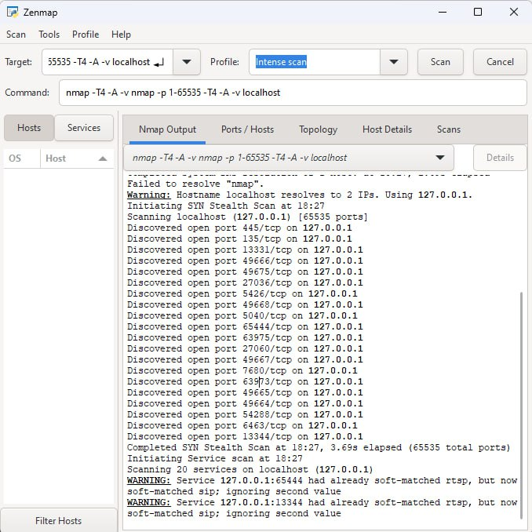

после завершения сканирования можно посмотреть результат в разделе **"Posts/Hosts"**:

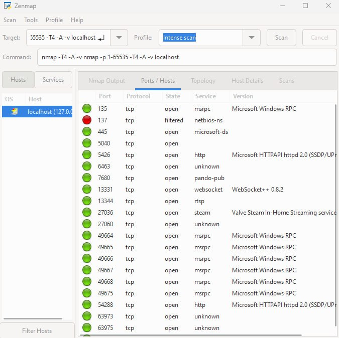

## Полное сканирование TCP портов

Для полного сканорования TCP поротов необходимо ввести команду: 

```bash
nmap -p 1-65535 -T4 -A -v localhost
```

и нажать кнопку **"Scan"**: 

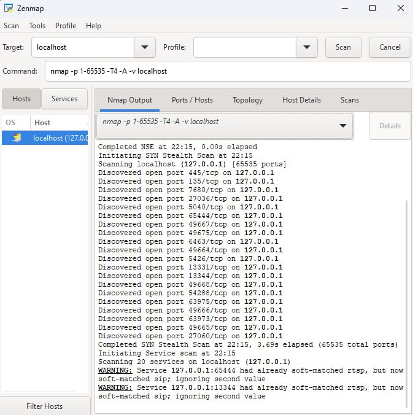

после завершения сканирования можно посмотреть результат в разделе **"Posts/Hosts"**:

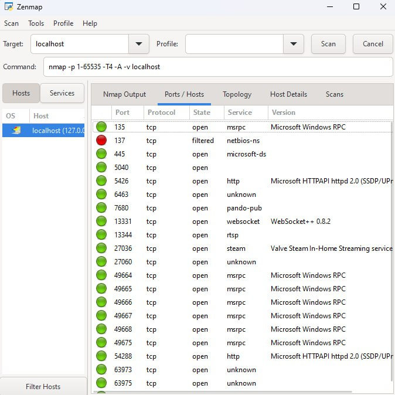

Результаты:

- Обнаружено 12 открытых TCP портов: `135`, `445`, `1434`, `5040`, `5354`, `5432`, `49664-49668`, `49670`.

- Порт `137/tcp` отмечен как **"filtered"** (вероятно, блокируется брандмауэром).

- Определены службы:

    - `135/tcp`: Microsoft Windows RPC.

    - `445/tcp`: microsoft-ds (возможно, SMB).

- Попытка определения ОС не дала точного результата, но предположительно это **Windows**.

## SYN сканирование (полуоткрытое)

Для проведения SYN-сканирования необходимо ввести команду:

```bash
nmap -sS -p- localhost
```

и нажать кнопку **"Scan"**: 

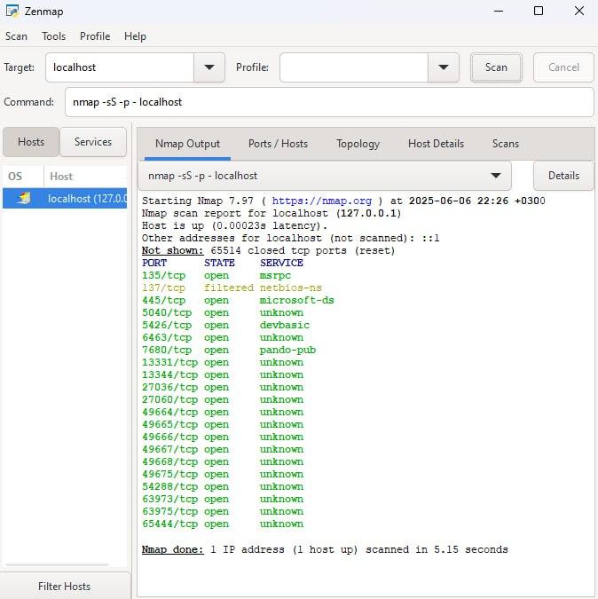

после завершения сканирования можно посмотреть результат в разделе **"Posts/Hosts"**:

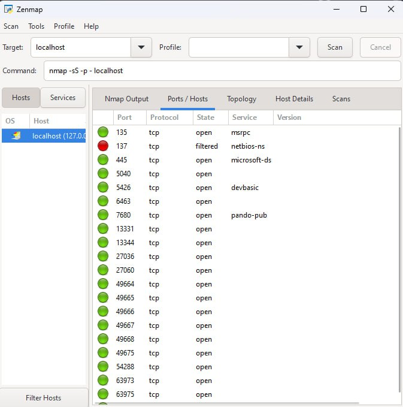

Результат:

- Те же 12 открытых портов.

- Нет информации о службах и ОС (так как не использовались флаги `-A` или `-sV`).

## FIN сканирование (для обхода некоторых фаерволов)

Для проведения FIN-сканирования необходимо ввести команду:

```bash
nmap -sF -p- localhost
```

и нажать кнопку **"Scan"**: 

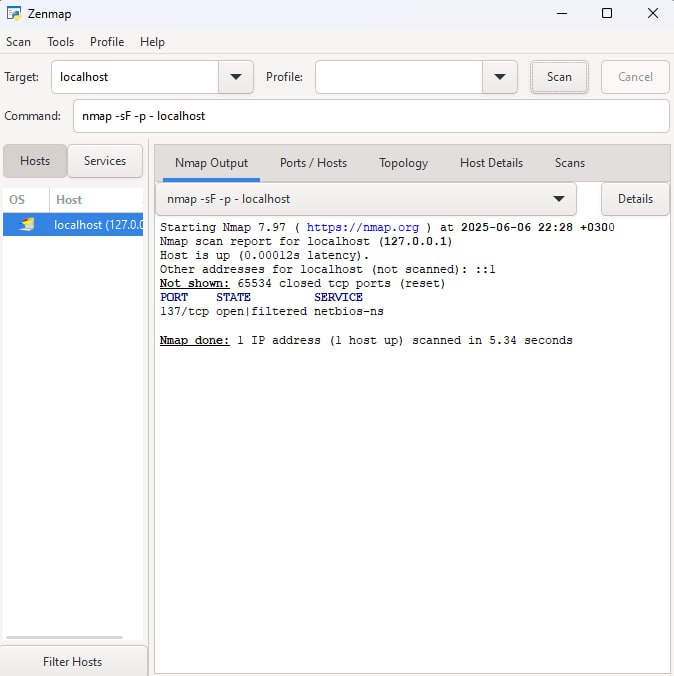

после завершения сканирования можно посмотреть результат в разделе **"Posts/Hosts"**:

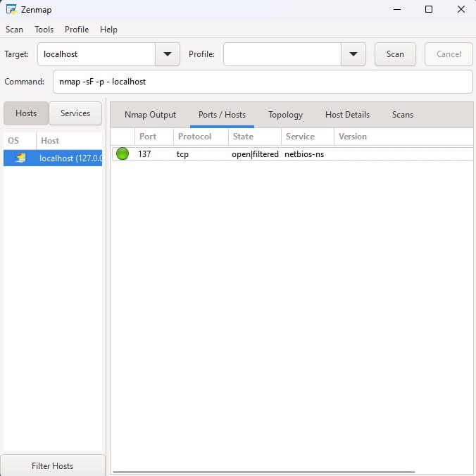

Результат:

- Обнаружен единственный порт с состоянием `open|filtered`: `137/tcp` (netbios-ns).

- Все остальные 65534 порта закрыты (получили `RST-ответ`).

- Порт 137/tcp:

    - Статус `open|filtered` означает, что система не отправила `RST-пакет` в ответ на FIN-сканирование.

    - Типичное поведение для:

        - Открытого порта на **Windows**.

        - Порта, защищенного фаерволом.

        - Некорректно настроенного сетевого фильтра.

## UDP сканирование

Для проведения UDP-сканирования необходимо ввести команду: 

```bash
nmap -sU -p 1-500 localhost
```

и нажать кнопку **"Scan"**: 

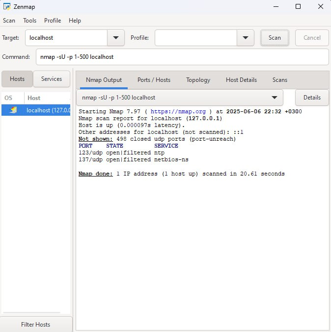

после завершения сканирования можно посмотреть результат в разделе **"Posts/Hosts"**:

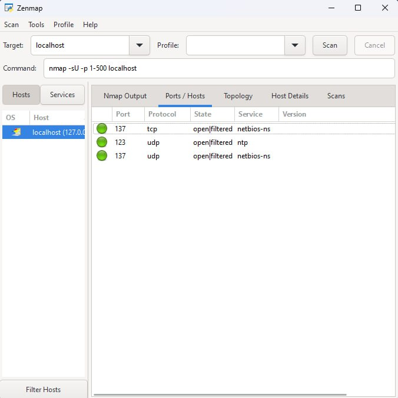

Результаты:

- Обнаружен 2 UDP порта со статусом `open|filtered`: `137/udp` (netbios-ns), `123/udp` (ntp).

- 499 UDP портов закрыты (`port-unreach`).

Результаты: 

- UDP сервисы:

    - Обнаружен подозрительный UDP-порт 137 (netbios-ns) с состоянием `open|filtered`.

    - Это типично для Windows-систем (NetBIOS Name Service).

    - Статус `open|filtered` означает, что Nmap не может точно определить открыт ли порт из-за возможной фильтрации.

- Разница в результатах TCP-сканирований:

    - Полное сканирование (`-p 1-65535`) выявило все 12 открытых TCP портов.

    - Быстрое сканирование (`-sS -p-`) показало те же порты, но без деталей.

    - Комбинированное сканирование (`-sS -sU`) в выводе показало только основные порты (вероятно из-за ограничения по умолчанию 500 портов).

## Определение операционной системы

Для определения операционной системы с помощью `Nmap` необходимо ввести команду: 

```bash
nmap -O localhost
```

и нажать кнопку **"Scan"**: 

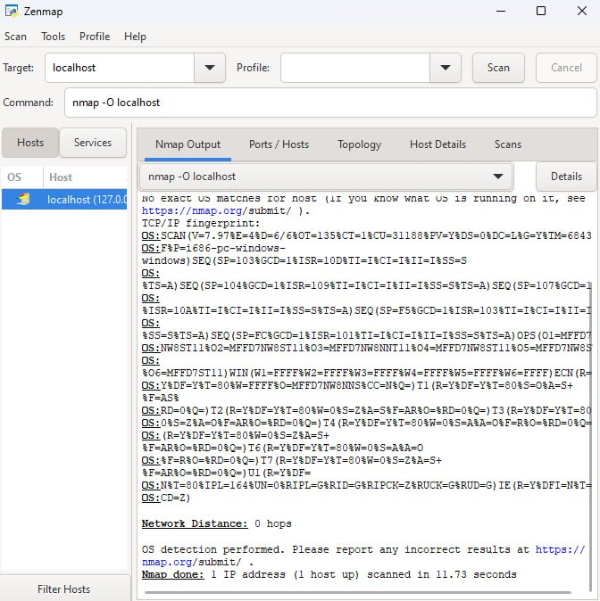

после завершения сканирования можно посмотреть результат в разделе **"Host Details"**:

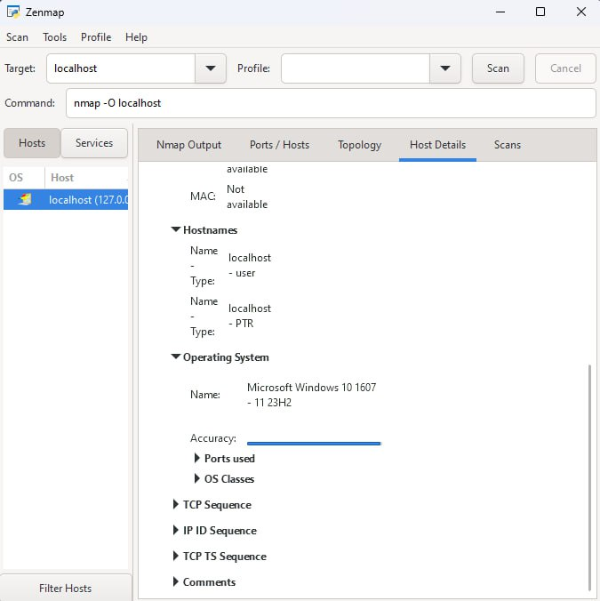

Результаты: 

- В разделе **"Host Details"** содержится информация об операционной системе в секции **"Operating System"**. Но значение указано неверно, так как установлена Windows 11, а в программе отображается 10 версия.

- В результатах сканирования также есть упоминание об операционной системе: `pc-windows`.

- Резульаты показали, что операционная система машины действительно **Windows**, но версия указана неверно.

## Поиск адресов активных хостов в сети

Чтобы это сделать без сканирования портов необходимо для поля **"Target"** указать значение `192.168.1.1/24` и ввести команду: 

```bash
nmap -sn 192.168.1.1/24
```

и нажать кнопку **"Scan"**: 

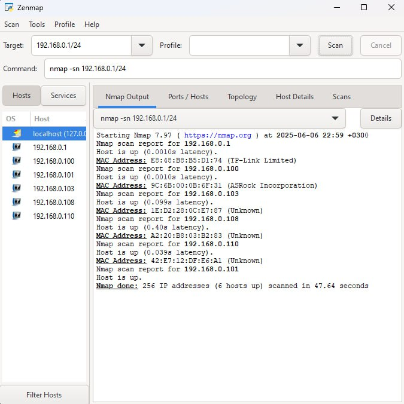

Результаты:

- Диапазон сканирования: `192.168.0.1`-`192.168.0.254` (256 адресов).

- Обнаружено активных хостов: 5 устройств.

- Время сканирования: 47.64 секунды.

- Метод: `Ping`-сканирование (без проверки портов).

## Сканирование хоста

```bash
nmap -sS 192.168.0.1
```

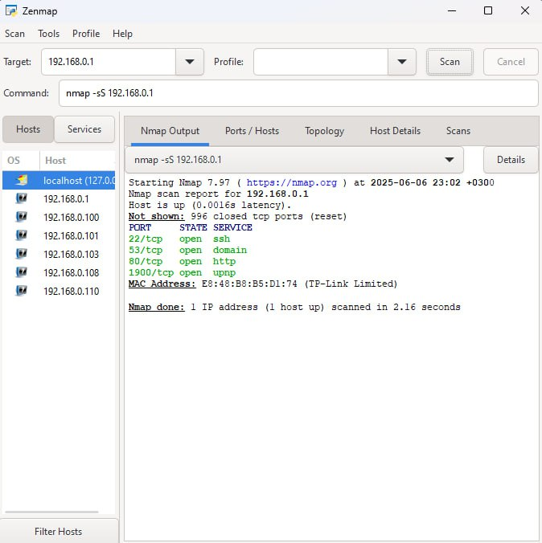

TCP `SYN`-сканирование (`-sS`): 

- Открытые порты:

    - `22/tcp` (ssh).

    - `53/tcp` (domain).

    - `80/tcp` (HTTP) – веб-интерфейс роутера.

    - `1900/tcp` (upnp).

- 996 портов закрыты.

- Вывод: Роутер отвечает на `SYN`-запросы.

```bash
nmap -sT 192.168.0.1
```

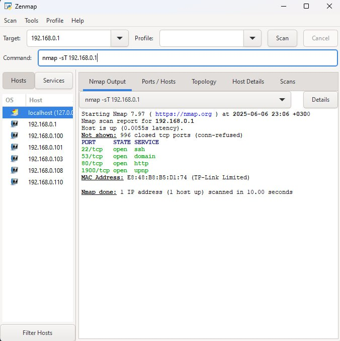

TCP `Connect`-сканирование (`-sT`): 

- Те же открытые порты (22, 53, 80, 1900), 996 портов закрыты (соединение разорвано).

- Разница с SYN-сканированием:

    - `-sT` использует полное TCP-подключение.

    - -`sS` (SYN) более скрытное.

```bash
nmap -sU -p 1-20 192.168.0.1
```

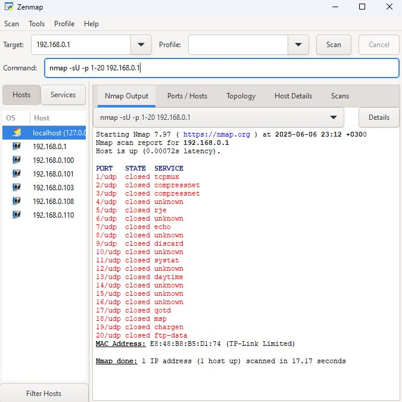

UDP-сканирование (`-sU -p 1-20`):

- Все 20 портов в состоянии `closed`.

Вывод:

- UDP-порты либо не используются, либо защищены фаерволом.

- Для точного определения нужны дополнительные проверки.

```bash
nmap -sF 192.168.0.1
```

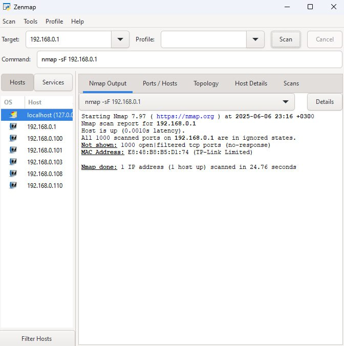

`FIN`-сканирование (`-sF`):

- Все 1000 портов open|filtered – роутер игнорирует `FIN`-пакеты.

- Вывод:

    - Это типичное поведение для устройств с фаерволом.

    - `FIN`-сканирование неэффективно против данного роутера.

```bash
nmap -sO 192.168.0.1
```

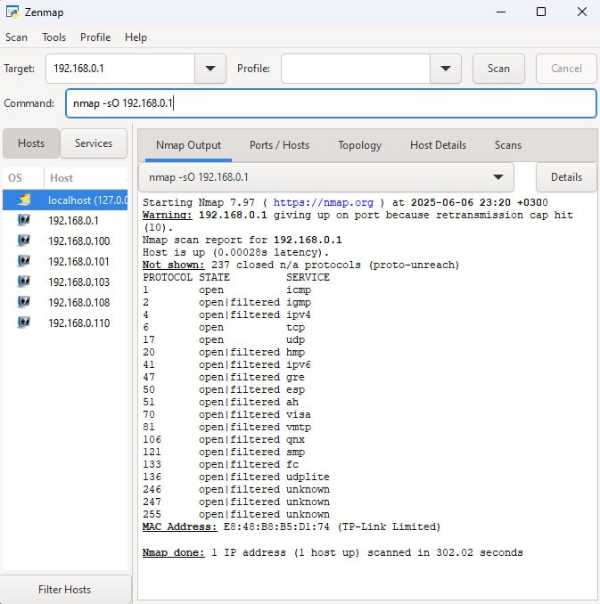

Поддерживаемые протоколы:

- Открытые (`open`):

    - `1/icmp` (Ping).

    - `6/tcp` (основной для HTTP, Telnet и др.).

    - `17/udp` (DNS, DHCP и др.).

- Частично фильтруемые (`open|filtered`):

    - `2/igmp` (групповые рассылки).

    - `4/ipv4`.

    - `41/ipv6`.

    - `47/gre` (туннелирование).

```bash
nmap -sV -p 23,80,49152 192.168.0.1
```

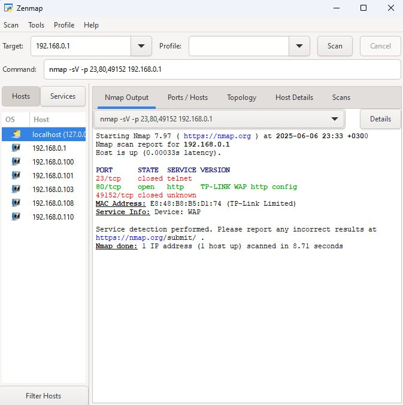

## Анализ с помощью Wireshark

Для записи трафика в `Wireshark` выбрал Ethernet, так как машина подключена к сети через `Ethernet`.

Запрашиваем сканирование в `Nmap`:

```bash
nmap -sS -p 80 192.168.0.1
```

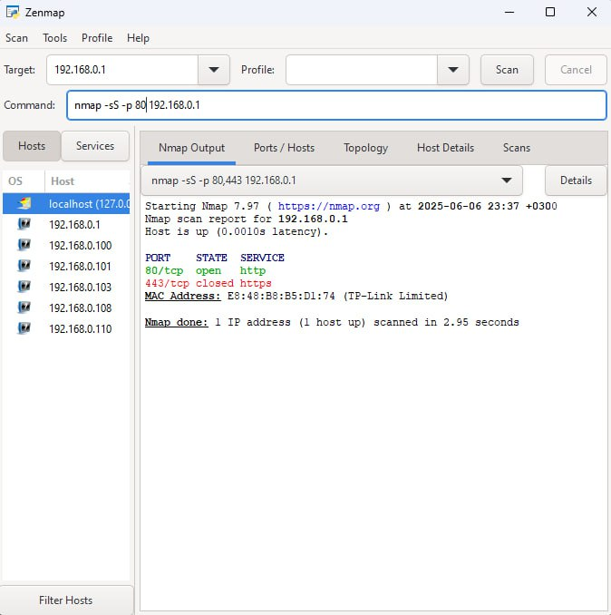

Ставим фильтр для `Wireshark`:

```bash
ip.src == 192.168.0.1 || ip.dst == 192.168.0.1
```

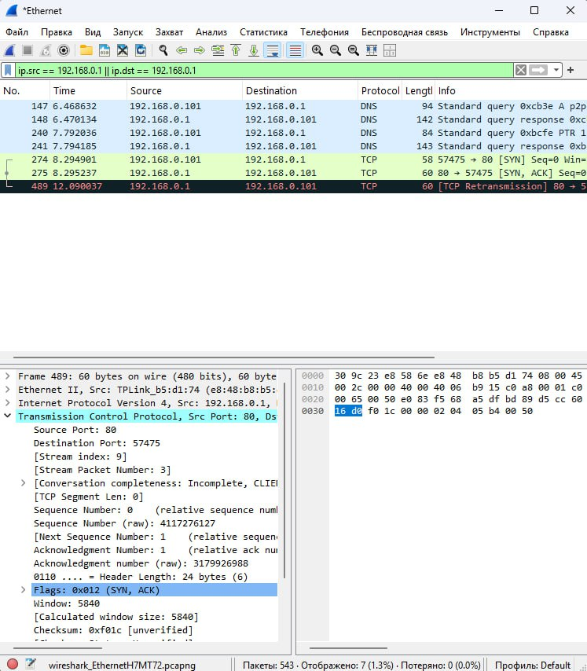

```bash
tcp.port == 80
```

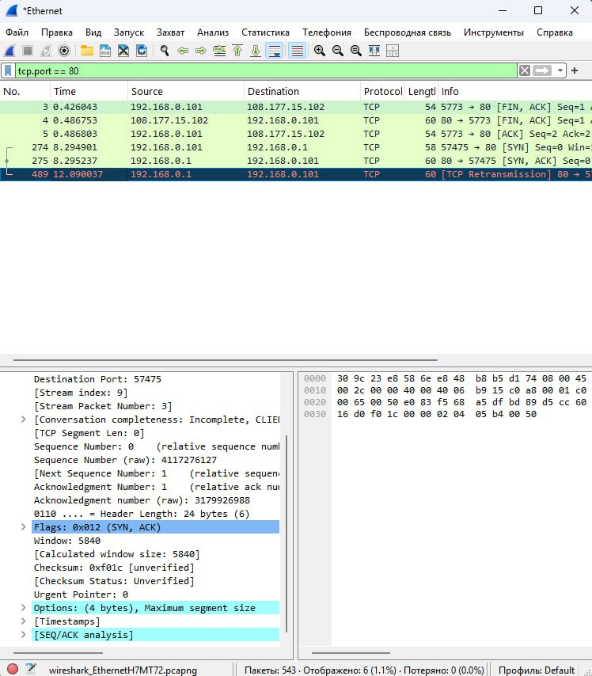

Что видно в `Wireshark`:

- Хост отправляет `TCP`-пакеты с флагом `SYN` на порт 80.

- Роутер отвечает `SYN-ACK` для порта 80.

- `Nmap` не завершает `handshake` (не отправляет `ACK`) → "полуоткрытое" сканирование.