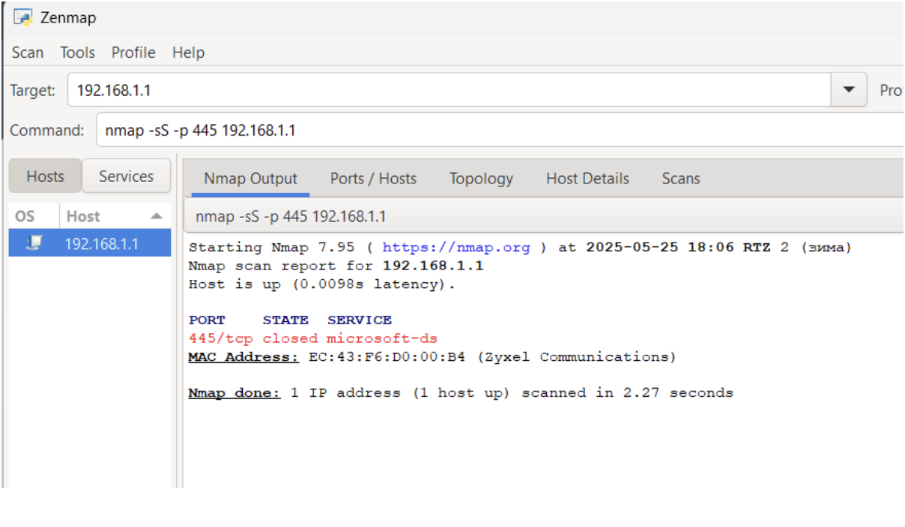

## Лабораторная работа

Открыл брандмауэр


Проверил настройки


Убедился что сайт открывается, значит соединение установлено


Создаю правило


Делаю также как в документе с лабораторной работой


Для портов 80, 443


Создалось правило, запустил его и попробовал зайти на сайт


Соединения нет, зайти на сайт не получается


отключил и соединение восстановлено.

## Самостоятельная работа

Для выполнения самостоятельной работы запустил две виртуальные машины.

Ip адресса на машинах `192.168.1.1` и `192.168.1.2`


Проверил ping между машинами, все в порядке


На первой машине разрешил все подключения 


## Сканирование узла 192.168.1.1 с помощью Nmap

Далее пробую сделать сканирование на другой машине
Сканирую командой 

```bash
nmap -sV -O -p 1-1000 192.168.1.1
```
со второй машины 
Сканирование `192.168.1.1` с `192.168.1.2` с помощью `Nmap` проведено успешно. TCP


Найдено:

- `23/tcp` `Telnet` `OPEN`

- `80/tcp` `HTTP` `OPEN`

- Остальные 998 портов в диапазоне 1-1000 закрыты (closed).

Определение ОС: 

- Устройство: ZyXEL Keenetic 4G II  (wi-fi роутер)
- ОС: Linux (встроенная прошивка).

Сканирование UDP-портов 192.168.1.1 с 192.168.1.2 проведено успешно.


## UDP сканирование
команда: 

```bash
nmap -sU -p 1-1000 192.168.1.1
```


- `53/udp` `domain` `(DNS) OPEN`

- `67/udp` `dhcps` `OPEN|FILTERED`

Закрытые порты:

- Остальные 998 UDP-портов в диапазоне 1-1000 закрыты (port-unreach).

## Создание правила, блокирующего порты 130-140 (TCP)


Блокирую порты tcp 130-140


Nmap с другой машины дал такой ответ 


Ожидалось `filtered`

## Блокировка ICMP (ping)


Блокировка удалась


## Блокировка всех входящих TCP и UDP пакетов

Создал два правила для блокировки портов `tcp` и `udp` 


провожу сканирование с помощью команды: 

```bash
nmap -sS -sU 192.168.1.1
```

Результат:


## Запрет ICMP только для 192.168.1.2


Запрет ICMP только для 192.168.1.2

- Изменение правила блокировки ICMP:
    - Область → Указать IP-адреса → 192.168.1.2.

Блокируется, как и должно


Меняю ip, для того чтобы обойти правило брандмауэра


Проверяю Ping
Работает


## Анализ трафика в Wireshark

Открыл `WireShark` для захвата трафика
Сканирую командой 

```bash
nmap -p 445 192.168.1.1
```

Обычное сканирование (TCP-connect)


Порт закрыт 
Вот что показал `WireShark`


Второе сканирование 
Команда: 

```bash
nmap -sS -p 445 192.168.1.1
```

SYN-сканирование (полуоткрытое)



Появились еще две записи в `WireShark`


Вывод (`tcp` сканирование):

- Результат идентичен SYN-сканированию, так как порт не принимает соединений.

- В реальной сети разница была бы видна, если порт открыт (SYN-сканирование не завершает handshake, а TCP-connect — завершает).

Вывод (`syn` сканирование):

- Порт 445 закрыт (не слушается сервисом), так как целевая машина отвечает `RST` + `ACK`.

- SYN-сканирование не требует завершения handshake, поэтому Nmap сразу определяет порт как `closed`.

## Итоги

Выполненные работы

### Проверка работы брандмауэра `Windows`

- Проверил доступность сайта при включенном брандмауэре – соединение работает.

- Создал правило для блокировки портов 80 (`HTTP`) и 443 (`HTTPS`).

- После активации правила доступ к сайтам пропал.

- После отключения правила соединение восстановилось.

Вывод: Брандмауэр корректно блокирует трафик по заданным правилам.

### Работа с двумя виртуальными машинами

- Настроил две виртуальные машины с IP-адресами:

    - 192.168.1.1 (роутер ZyXEL Keenetic)
    - 192.168.1.2 (тестовая машина)

- Проверил связность через ping – успешно.

### Сканирование Nmap

- TCP-сканирование (nmap -sV -O -p 1-1000 192.168.1.1)

- Обнаружены открытые порты:

    - `23/tcp` (Telnet) – уязвимость (лучше отключить).

    - `80/tcp` (HTTP) – веб-интерфейс роутера.

    - Остальные порты закрыты.

    - Определена ОС: Linux (ZyXEL Keenetic 4G II).
    
- UDP-сканирование (nmap -sU -p 1-1000 192.168.1.1)

- Обнаружены:

    - `53/udp` (DNS) – открыт.

    - `67/udp` (DHCP) – open|filtered.

    - Остальные UDP-порты закрыты.

### Настройка правил брандмауэра

- Блокировка TCP-портов 130-140

    - После создания правила сканирование (nmap -p 130-140 192.168.1.1) показало filtered (порты заблокированы).

- Блокировка ICMP (ping)

    - Ping с 192.168.1.2 не проходит.

    - Если изменить IP-адрес источника – ping работает.

- Блокировка всех входящих TCP/UDP-пакетов

    - Сканирование (nmap -sS -sU 192.168.1.1) не обнаружило открытых портов.

### Анализ трафика в Wireshark

- Обычное TCP-сканирование (nmap -p 445 192.168.1.1)

    - Wireshark зафиксировал SYN → RST+ACK (порт закрыт).

- SYN-сканирование (nmap -sS -p 445 192.168.1.1)

    - Аналогичный результат, но без завершения TCP-handshake.

Вывод: SYN-сканирование более скрытное, но в данном случае разницы нет, так как порт закрыт.

### Выводы

- Брандмауэр `Windows` эффективно блокирует трафик по заданным правилам.

- `Nmap` позволяет обнаруживать открытые порты и сервисы, а также обходить простые методы фильтрации (например, SYN-сканирование).

- `Wireshark` помогает анализировать сетевой трафик и проверять работу брандмауэра.

## Ответы на вопросы по межсетевым экранам

1. Принципы работы межсетевых экранов

Межсетевые экраны (брандмауэры) выполняют несколько ключевых функций:

- Анализируют и фильтруют сетевой трафик по заданным правилам

- Контролируют доступ к сети на основе IP-адресов, портов и протоколов

- Отслеживают состояние активных соединений (`stateful inspection`)

- Могут выполнять трансляцию сетевых адресов (`NAT`)

- Обеспечивают защиту от сетевых атак

2. Конфигурирование межсетевого экрана Windows

Настройка выполняется через:

- Панель управления → Брандмауэр Защитника Windows

- Приложение "Параметры" → Обновление и безопасность → Брандмауэр Windows

- Консоль управления (`mmc`) с оснасткой "Брандмауэр Windows в режиме повышенной безопасности"

3. Классификация межсетевых экранов

Выделяют несколько типов:

- `Пакетные фильтры` - простейшие, работают на сетевом уровне

- `Шлюзы сеансового уровня` - анализируют состояние соединений

- `Прикладные шлюзы` - проверяют содержимое трафика

- `Многоуровневые` - комбинируют несколько методов проверки

4. Профили брандмауэра

Windows использует три профиля:

1) Домен - для корпоративных сетей с контроллером домена

2) Частный - для доверенных сетей (домашних или рабочих)

3) Общий - для публичных сетей с максимальными ограничениями

5. Состояние брандмауэра

Может быть:

1) Включен (рекомендуется) - все правила активны

2) Отключен (не рекомендуется) - весь трафик разрешен

Проверяется в настройках брандмауэра.

6. Правила соединений

- Входящие правила - управляют внешними подключениями к компьютеру

- Исходящие правила - контролируют доступ программ в интернет

Для каждого можно задать разрешающее или запрещающее действие.

7. Создание исходящего правила

Через мастер создания правил:

1) Выбираем тип правила (для программы, порта или настраиваемое)

2) Указываем параметры (путь к программе, номера портов)

3) Задаем действие (разрешить или заблокировать)

4) Выбираем профили, к которым применяется правило

5) Даем понятное имя правилу