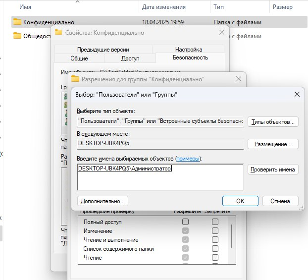
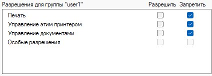

## Содержание 

- [Задание](#задание)
- [Подготовка](#подготовка)
    - [Создание папок](#создание-папок)
    - [Создание файлов](#создание-файлов)
    - [Создание новых пользователей](#создание-новых-пользователей)
- [Настройка прав доступа](#настройка-прав-доступа)
    - [Папка "Общедоступно"](#папка-общедоступно)
    - [Папка "Конфиденциально"](#папка-конфиденциально)
    - [Исполняемый файл в "Конфиденциально"](#исполняемый-файл-в-конфиденциально)
    - [Настройка принтера](#настройка-принтера)
- [Ответы на вопросы](#ответы-на-вопросы)
    - [1. Перечислите стандартные права доступа к файловым объектам в NTFS](#1-перечислите-стандартные-права-доступа-к-файловым-объектам-в-ntfs)
    - [2. Принцип работы разрешения «Запись»](#2-принцип-работы-разрешения-запись)
    - [3. Перечислите элементы разрешений](#3-перечислите-элементы-разрешений)
    - [4. Кто может стать владельцем объекта](#4-кто-может-стать-владельцем-объекта)
    - [5. Понятие наследования разрешений](#5-понятие-наследования-разрешений)
    - [6. Как отключить наследование разрешений](#6-как-отключить-наследование-разрешений)
    - [7. Как реализовать принудительное наследование вложенными объектами установленных разрешений](#7-как-реализовать-принудительное-наследование-вложенными-объектами-установленных-разрешений)
    - [8. Приоритеты применения разрешений](#8-приоритеты-применения-разрешений)
- [Итог выполненной работы](#итог-выполненной-работы)

## Задание

Создайте каталоги **"Общедоступно"** и **"Конфиденциально"**.   
В каждом из этих каталогов скопируйте исполняемый и текстовый файлы. 
Разграничьте доступ к принтеру, а также созданным каталогам и файлам в соответствии со своим вариантом.

Для лабораторной работы мне выпал 6 вариант.

## Подготовка

### Создание папок

Перед выполнением работы необходимо создать каталоги **"Общедоступно"** и **"Конфиденциально"**. Для этого я создал дополнительно папку **"TestFolder"**. 


Сделать это можно через **Проводник**, либо следующими командами для `PowerShell`: 

```shell
mkdir D:\Общедоступно
mkdir D:\Конфиденциально
```

> **Примечание:** Команды указаны для создания папок на диске D. При создании папок командами необходимо заменить пути к папкам (D:\TestFolder\Общедоступно, например).

### Создание файлов

Далее необходимо создать в каждом каталоге исполняемый и текстовый файлы. Удобного способа сделать это через проводник я не нашёл, поэтому покажу на примере `PowerShell`.

1) В папке **"TestFolder"** в пустом месте необходимо нажать правой кнопкой мыши.

2) Далее необходимо выбрать в появившемся диалоговом окне **"Открыть в терминале"**. 

3) В открывшемся окне терминала необходимо выполнить следующие команды:

```shell
echo "Hello from public!" > .\Общедоступно\text.txt
echo "echo Executing..." > .\Общедоступно\runme.exe

echo "Confidential text" > .\Конфиденциально\text.txt
echo "echo secret running" > .\Конфиденциально\runme.exe
```


После выполнения команд папки должны были измениться:


В каждой папке теперь есть как исполняемый, так и текстовый файлы.

### Создание новых пользователей

> Как создавать новых пользователей через оснастку **"Локальные пользователи и группы"** я описывал в прошлой лабораторной работе (см. *[Создание учётной записи](https://github.com/a1unade/Cybersecurity/tree/main/1#%D1%81%D0%BE%D0%B7%D0%B4%D0%B0%D0%BD%D0%B8%D0%B5-%D1%83%D1%87%D1%91%D1%82%D0%BD%D0%BE%D0%B9-%D0%B7%D0%B0%D0%BF%D0%B8%D1%81%D0%B8)*). В этой работе покажу способ с помощью `PowerShell`.

Для начала необходимо открыть `PowerShell` от имени Администратора, иначе команды будут выполнены с ошибкой: **"Системная ошибка: 5. Отказано в доступе."**.


Чтобы создать пользователей через `PowerShell` нужно:

1) Открыть меню **"Пуск"** и в строке поиска ввести `PowerShell`

2) Щелкнуть правой кнопкой мыши по `PowerShell` и выбрать опцию **"Открыть от имени Администратора"** и подтвердить действие во всплывающем окне с предупреждением.


3) Далее в окне терминала необходимо выполнить следующие команды:

```shell
net user user1 P@ssword123 /add
net user user P@ssword456 /add
```

В терминале должен получиться следующий результат: 


Проверить выполнение команды можно в оснастке **"Локальные пользователи и группы"**. Как ее открыть я так же описывал в прошлой работе (см. *[Открытие оснастки "Локальные пользователи и группы"](https://github.com/a1unade/Cybersecurity/tree/main/1#%D0%BE%D1%82%D0%BA%D1%80%D1%8B%D1%82%D0%B8%D0%B5-%D0%BE%D1%81%D0%BD%D0%B0%D1%81%D1%82%D0%BA%D0%B8-%D0%BB%D0%BE%D0%BA%D0%B0%D0%BB%D1%8C%D0%BD%D1%8B%D0%B5-%D0%BF%D0%BE%D0%BB%D1%8C%D0%B7%D0%BE%D0%B2%D0%B0%D1%82%D0%B5%D0%BB%D0%B8-%D0%B8-%D0%B3%D1%80%D1%83%D0%BF%D0%BF%D1%8B)*).

Я покажу сам результат, который должен получиться в оснастке. Появились *user* и *user1* в списке пользователей:


## Настройка прав доступа

Согласно моему варианту нужно установить такие права:


>Перед началом стоит отметить, что есть два пути с настройкой прав доступа для пользователей:
>
>1) С помощью команды `icacls`  
>
>2) Через меню проводника    
> 
> Я буду показывать на примере меню проводника, но приложу инструкции и для терминала.

### Папка "Общедоступно"

Настроим права для папки **"Общедоступно"**:

1) Администратор → Полный доступ.  

2) user → Чтение и удаление.  

3) user1 → Изменить.

Чтобы настроить с помощью `PowerShell`, достаточно выполнить следующие команды в терминале: 
```shell
icacls D:\Общедоступно /grant Администратор:(F)

icacls D:\Общедоступно /grant user:(RD)

icacls D:\Общедоступно /grant user1:(M)
```

> **Примечание:** Как я уже отмечал, команды указаны для папок на диске D. При выполнении команд необходимо заменить пути к папкам (D:\TestFolder\Общедоступно, например) на свои.

Я покажу как сделать так же на примере программы **"Проводник"**, что сделать будет сложнее, но зато наглядно и на примере.

Итак, шаги для выполнения задачи:

1) Выбрать папку **"Общедоступно"** и нажать на нее правой кнопкой мыши. В контекстном меню выбрать пункт **"Свойства"**.


2) В верхней части окна **"Свойства"** выбрать пункт **"Безопасность"**.


В списке пользователей нет нужных нам *user* и *user1*, поэтому нужно добавить их вручную. 

3) Чтобы начать редактирование, необходимо нажать кнопку **"Изменить"**.


4) Под списком пользователей нажать кнопку **"Добавить"**, ввести имя нужного пользователя, затем **"Ок"**.


В списке пользователей появятся *user* и *user1*: 


5) Далее выбрать пользователя левой кнопкой мыши и в списке **"Разрешения для группы"** проставить галочки напротив необходимых прав. Для Администратора уже был выставлен полный доступ, осталось настроить *user* и *user1*.

6) Для *user* стоят особые права **"Чтение и удаление"**, которые не задать только в меню **"Безопасность"**, поэтому выставим только доступные параметры:


7) Нажимаем **"Применить"**, затем **"Ок"**. С **"Удалить"** чуточку сложнее, нужно нажать на кнопку **"Дополнительно"** в меню **"Безопасность"**:


8) В открывшемся окне выбираем нужного пользователя и нажимаем **"Изменить"**, затем **"Отображение дополнительных разрешений"**:


9) В списке видим особое разрешение **"Удалить"**, выбираем его и нажимаем **"Ок"**. Выбираем **"Применить"**, затем **"Ок"**. Готово, настройка пользователя *user* завершена.

Для настройки *user1* последовательность шагов аналогичная, просто покажу результат настройки:


> При выставлении **"Изменение"** система автоматически добавит еще несколько обязательных прав доступа.

### Папка "Конфиденциально"

Настроим права для папки **"Конфиденциально"**:

1) Администратор → Чтение.  

2) user → Список содержимого.  

3) user1 → Нет доступа.

В прошлом пункте я описал последовательность шагов, которые позволят настроить права доступа через **"Проводник"**. Не буду повторять сам алгоритм и последовательность шагов, покажу только результат.

Как и с прошлой настройкой все шаги можно сделать через `PowerShell`. Список команд: 

```shell
icacls D:\Конфиденциально /grant Администратор:(R)

icacls D:\Конфиденциально /grant user:(RX)

icacls D:\Конфиденциально /deny user1:(F)
```

> **Примечание:** Как и в случае других примеров с `PowerShell`, команды указаны для папок на диске D. При выполнении команд необходимо заменить пути к папкам (D:\TestFolder\Общедоступно, например) на свои.

>Важно отметить: для настройки прав для пользователя *Администратор*, необходимо добавить его так же список пользователей, как и *user* с *user1*. Сама настройка происходит так же, как и с обычным пользователем.



Настройка для пользователя *Администратор*:


Настройка для пользователя *user*:


Настройка для пользователя *user1*:


### Исполняемый файл в "Конфиденциально"

Настроим права для исполняемого файла в **"Конфиденциально"**:

1) Администратор → Изменить.  

2) user → Выполнение.  

3) user1 → Нет доступа.

Как и с прошлой настройкой все шаги можно сделать через `PowerShell`. Список команд: 

```shell
icacls D:\Конфиденциально\runme.exe /grant Администратор:(M)

icacls D:\Конфиденциально\runme.exe /grant user:(X)

icacls D:\Конфиденциально\runme.exe /deny user1:(F)
```

> **Примечание:** Как и в случае других примеров с `PowerShell`, команды указаны для папок на диске D. При выполнении команд необходимо заменить пути к папкам (D:\TestFolder\Общедоступно, например) на свои.

> Настройка для исполняемого файла такая же, как и в случае с папкой. Вместо папки выбираем сам файл и открываем его свойства.

Покажу сам результат настройка для каждого пользователя.

Настройка для пользователя *Администратор*:


Настройка для пользователя *user*:


Настройка для пользователя *user1*:


### Настройка принтера

> Принтер использовал виртуальный.

Принтер настраивается так же, как и остальные права доступа через **"Свойства"** → **"Безопасность"**. Покажу только сами права для принтера.

Чтобы настроить права доступа для принтера необходимо: 

1) Перейти в **"Панель управления"** → **"Просмотр устройств и принтеров"** → **"Принтеры и сканеры"** → выбрать нужный принтер → **"Свойства"** → **"Безопасность"**.

Настройка для пользователя *Администратор*:


Настройка для пользователя *user*:



Настройка для пользователя *user1*:


## Ответы на вопросы

### 1. Перечислите стандартные права доступа к файловым объектам в NTFS

Стандартные разрешения:

- Полный доступ

- Изменение

- Чтение и выполнение

- Просмотр содержимого папки

- Чтение

- Запись

### 2. Принцип работы разрешения «Запись»

Разрешение «Запись» позволяет:

- Изменять содержимое файла

- Создавать новые файлы и папки внутри папки

- Переименовывать файлы

- Записывать данные в уже существующие файлы

> **НО**: Не даёт права удалять или выполнять файлы.

### 3. Перечислите элементы разрешений

Это разрешения на уровне объектов, например:

- Чтение данных

- Запись данных

- Удаление

- Изменение разрешений

- Владение

- Выполнение файла

- Чтение/запись атрибутов

- Удаление подкаталогов и файлов

### 4. Кто может стать владельцем объекта

Владельцем может быть:

- Пользователь, создавший объект

- Администратор

- Пользователь с правом "Изменить владельца"

### 5. Понятие наследования разрешений

**Наследование** — это механизм, при котором вложенные объекты (файлы, подпапки) получают права от родительской папки.

> Применяется автоматически, если включено.

### 6. Как отключить наследование разрешений

1) Щелкнуть правой кнопкой мыши по папке → **"Свойства"** → вкладка **"Безопасность"**.

2) Нажать **"Дополнительно"**.

3) Внизу окна — кнопка **"Отключить наследование"**.

4) Выбрать:

    - Удалить унаследованные разрешения, или

    - Преобразовать их в явные

### 7. Как реализовать принудительное наследование вложенными объектами установленных разрешений

В той же вкладке **"Дополнительно"**:

1) Нажать **"Изменить разрешения"**.

2) Внизу — включить галочку **"Заменить все записи разрешений дочернего объекта унаследованными от этого объекта"**.

3) **"Применить"** — и все вложенные папки/файлы получат новые разрешения

### 8. Приоритеты применения разрешений

Когда разрешения конфликтуют, применяются в таком порядке (по приоритету):

1) Явный отказ (*ВСЕГДА имеет приоритет, блокирует доступ*)

2) Явное разрешение (*Явно заданное, переопределяет наследуемое*)

3) Наследуемый отказ (*Ниже приоритета явного разрешения*)

4) Наследуемое разрешение (*Самый низкий приоритет*)

## Итог выполненной работы

- Создал папки **"Общедоступно"** и **"Конфиденциально"**.

- Скопировал в них текстовые и исполняемые файлы.

- Создал пользователей *user* и *user1*.

- Настроил разграничение прав доступа к папкам и файлам:

    - В **"Общедоступно"** — *user* может читать и удалять, *user1* — изменять.

    - В **"Конфиденциально"** — *user* может только просматривать и выполнять, *user1* заблокирован.

- Настроил ограничения доступа к принтеру.