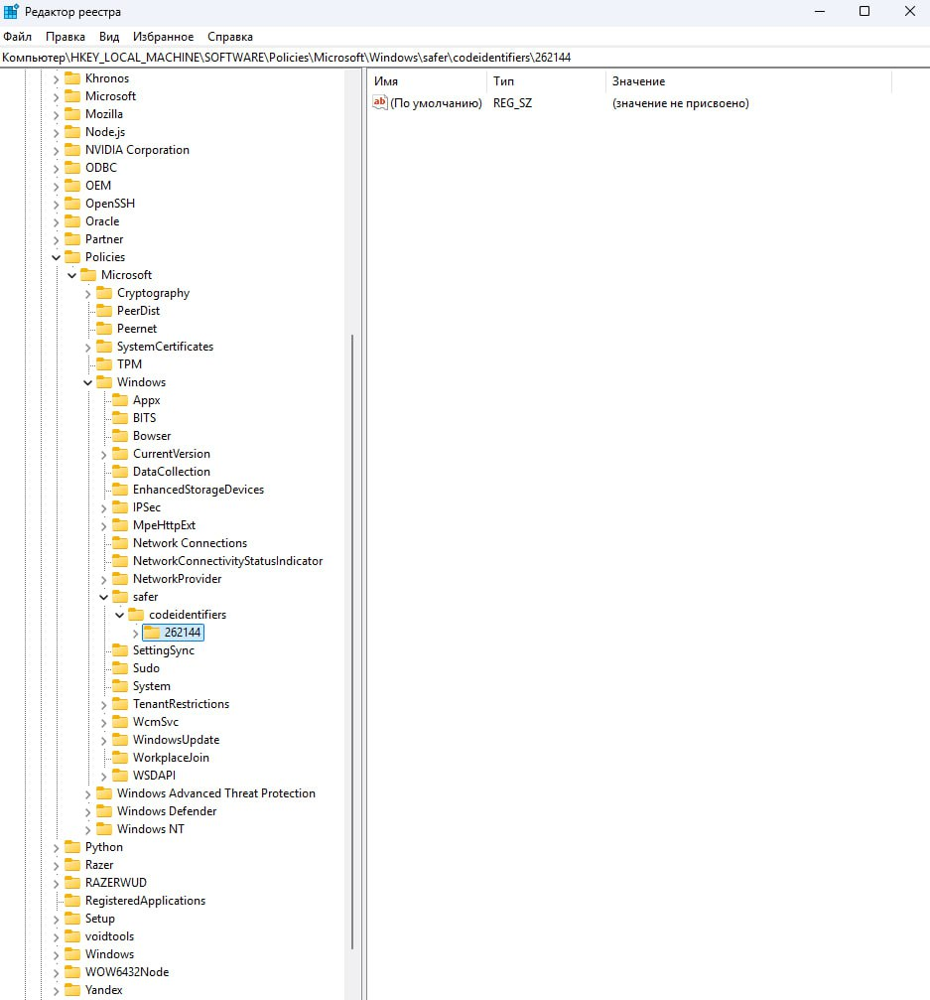
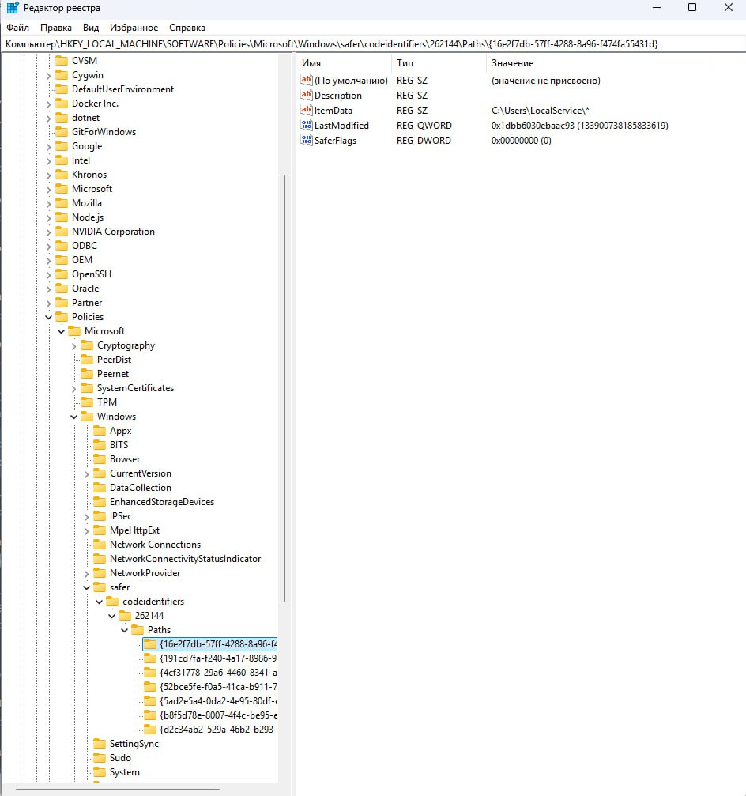
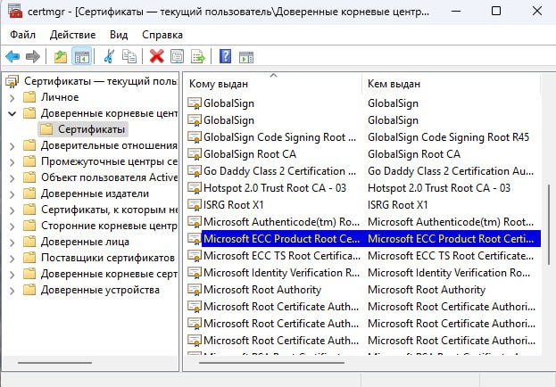
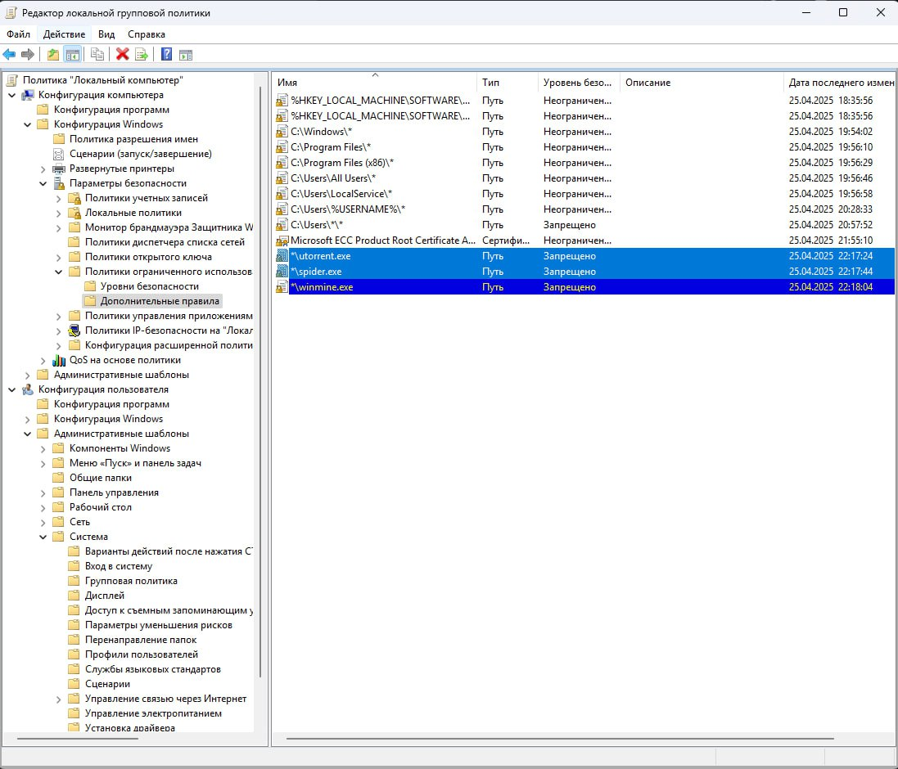

## Содержание 
- [Вступление](#вступление)
- [Подготовка](#подготовка)
- [Разрешение на запуск любых программ из выбранных папок](#разрешение-на-запуск-любых-программ-из-выбранных-папок)
    - [Уровни безопасности в Windows](#уровни-безопасности-в-windows)
- [Настройка разрешения запуска программ из папки пользователя через переменную окружения](#настройка-разрешения-запуска-программ-из-папки-пользователя-через-переменную-окружения)
- [Запрет запуска программ из папок других пользователей через приоритет правил пути](#запрет-запуска-программ-из-папок-других-пользователей-через-приоритет-правил-пути)
- [Настройка разрешения установки ПО, подписанного сертификатом Microsoft](#настройка-разрешения-установки-по-подписанного-сертификатом-microsoft)
    - [Экспорт сертификата Microsoft](#экспорт-сертификата-microsoft)
    - [Настройка разрешения установки ПО](#настройка-разрешения-установки-по)
- [Запрет запуска конкретных программ](#запрет-запуска-конкретных-программ)
- [Итог](#итог)

## Вступление 

Лабораторная работа посвящена теме **"Разграничение доступа к запуску
программного обеспечения"**. Для 6 варианта необходимо выполнить:

- Создайте следующую политику ограничения использования
программ, которая будет удовлетворять следующим требованиям:

    е) Разрешает запуск любых программ из папок:
   - `C:\WINDOWS`
   - `C:\Program Files`
   - `C:\Documents and Settings\LocalService`
   - `C:\Documents and Settings\All Users`

    ж) Разрешает запуск любых программ пользователю из своей папки `C:\Documents and Settings\user` (где `user` — имя любого пользователя) при помощи переменной окружения.

    з) При помощи приоритета правил пути пользователю запрещено запускать любые программы из папок других пользователей, как например `C:\Documents and Settings\Администратор`.

    и) Разрешает установку ПО, подписанного сертификатом от «Microsoft».

    к) Запрещает запуск программ «Паук», «Сапер» и `utorrent.exe` вне зависимости от их месторасположения.  

## Подготовка

> Для выполнения заданий будет использован **"Редактор локальной групповой политики"**, но такого же результата можно добиться используя **"Редактор реестра"**.

Перед выполнением задания необходимо открыть **"Редактор локальной групповой политики"**:

1) Сочетанием клавиш `Win + R` открыть диалоговое окно.

2) Ввести `gpedit.msc`.

3) Нажать `Enter`.

## Разрешение на запуск любых программ из выбранных папок

По заданию необходимо создать политику ограничения использования программ, которая разрешает запуск из папок:
   - `C:\WINDOWS`
   - `C:\Program Files`
   - `C:\Documents and Settings\LocalService`
   - `C:\Documents and Settings\All Users`

Чтобы создать необходимую политику, нужно открыть раздел **"Политики ограниченного использования программ"**:

1) В открывшемся редакторе нужно выбрать пункт **"Конфигурация компьютера"**.

2) Далее раскрыть список **"Конфигурация Windows"** → **"Политики ограниченного использования программ"**

Изначально у меня не было созданных политик, поэтому необходимо создать новую. Чтобы это сделать необходимо:

3) Правой кнопкой мыши нажать на **"Политики ограниченного использования программ"** и выбрать пункт **"Создать политику ограниченного использования программ"**:

Политика должна появиться, в списке добавятся пункты: **"Уровни безопасности"** и **"Дополнительные правила"**:

Далее необходимо добавить разрешённые пути в **"Дополнительные правила"**. Чтобы это сделать необходимо:

4) Открыть пункт **"Дополнительные правила"**. В открывшемся разделе правой кнопкой мыши кликнуть в пустом месте и выбрать пункт **"Создать правило для пути..."**

Должно появиться диалоговое окно:

Остается только добавить пути и выставить для них **"Уровень безопасности"** `Неограниченный`.

### Уровни безопасности в Windows

> Уровень `Неограниченный` будет служить исключением для существующего правила в `HKEY_LOCAL_MACHINE\SOFTWARE\Policies\Microsoft\Windows\Safer\CodeIdentifiers`, так как там находится папка `262144`, что значит, что политика ограничения программ настроена на режим **"Запрещено"** или **"Disallowed"**. Проверить это можно следующим образом:
>
> 1) Сочетанием клавиш `Win + R` открыть диалоговое окно.
>
> 2) Ввести `regedit`.
>
> 3) Нажать `Enter`.
> 
> Должен открыться **"Редактор реестра"**. Нужно пройти по пути `HKEY_LOCAL_MACHINE\SOFTWARE\Policies\Microsoft\Windows\Safer\CodeIdentifiers`. В левой части реестра выбираем `HKEY_LOCAL_MACHINE` → `SOFTWARE` → `Policies` → `Microsoft` → `Windows` → `Safer` → `CodeIdentifiers`.
> 
> 
> 
> Для `CodeIdentifiers` есть следующие значения:
>
> - `0` - **Неограниченно (Unrestricted)** - Все программы разрешены (по умолчанию).
> - `262144` - **Запрещено (Disallowed)** - Все программы блокируются, кроме явно разрешённых в правилах.
> - `131072` - **Обычный пользователь (Basic User)** - Программы запускаются с ограниченными правами (без админ-доступа).
>
> Такие же правила можно заметить и в **"Редакторе локальной групповой политики"**, если открыть раздел **"Уровни безопасности"** у пункта **"Политики ограниченного использования программ"**.
>
> 

Для каждого пути шаги аналогичны, покажу только для `C:\WINDOWS`:

1) В диалоговом окне **"Создание правила для пути"** необходимо указать `C:\WINDOWS\*` в поле **"Путь"**.

2) В разделе **"Уровень безопасности"** выбрать `Неограниченный`.

3) Нажать кнопку **"Применить"**, затем **"ОК"**.

Добавленный путь должен появиться в списке **"Дополнительные правила"**:

После добавления всех необходимых путей, должен получиться такой результат:

> Если открыть **"Редактор реестра"**, то можно будет увидеть добавленные пути в папке `CodeIdentifiers/262144/Paths`:
> 
> 

## Настройка разрешения запуска программ из папки пользователя через переменную окружения

В Windows путь к профилю пользователя можно задать через:

- `%USERPROFILE%` → `C:\Users\<Username>`

- `%HOMEPATH%` → `\Users\<Username>`

- `%USERNAME%` → имя текущего пользователя.

Для совместимости с Windows 11 (где `Documents and Settings` — виртуальная папка) лучше использовать: `%USERPROFILE%\*`.

> Это разрешит запуск программ из `C:\Users\<Username>\*`, включая подпапки.

Шаги для выполнения задания:

1) Необходимо перейти в **"Редактор локальной групповой политики"**, как его открыть было описано [тут](#подготовка).

2) Открыть **"Дополнительные правила"** в разделе **"Политики ограниченного использования программ"**. 
> Путь: **"Конфигурация компьютера"** → **"Параметры безопасности"** → **"Политики ограниченного использования программ"** → **"Дополнительные правила"**.

3) Правой кнопкой мыши кликнуть в пустом месте и выбрать пункт **"Создать правило для пути..."**.

4) В поле **"Путь"** ввести `%USERPROFILE%\*`.
> Либо `C:\Users\%USERNAME%\*`, если нужен явный путь.

5) В разделе **"Уровень безопасности"** выбрать `Неограниченный`.

6) Нажать кнопку **"Применить"**, затем **"ОК"**.

> Если открыть **"Редактор реестра"**, то можно будет увидеть добавленные пути в папке `CodeIdentifiers/262144/Paths`:
> 
> 

## Запрет запуска программ из папок других пользователей через приоритет правил пути

Чтобы запретить пользователям запускать программы из чужих профилей (например, `C:\Users\Администратор\*` или `C:\Documents and Settings\Другой_пользователь\*`), нужно:

Разрешить запуск только из своей папки (`%USERPROFILE%\*`).

Явно запретить все остальные пользовательские папки с более высоким приоритетом.

1) Необходимо перейти в **"Редактор локальной групповой политики"**, как его открыть было описано [тут](#подготовка).

2) Открыть **"Дополнительные правила"** в разделе **"Политики ограниченного использования программ"**. 
> Путь: **"Конфигурация компьютера"** → **"Параметры безопасности"** → **"Политики ограниченного использования программ"** → **"Дополнительные правила"**.

3) Правой кнопкой мыши кликнуть в пустом месте и выбрать пункт **"Создать правило для пути..."**.

4) В поле **"Путь"** ввести `C:\Users\*\*`.
> Блокирует `C:\Users`, кроме своей. **ИЛИ** точечно (если нужно заблокировать конкретных пользователей):
> - `C:\Users\Администратор\*`
>
> - `C:\Users\Другой_пользователь\*`

5) В разделе **"Уровень безопасности"** выбрать `Запрещено (Disallowed)`.

6) Нажать кнопку **"Применить"**, затем **"ОК"**.

Результат должен получиться таким: 

> Если открыть **"Редактор реестра"**, то можно будет увидеть добавленные пути в папке `CodeIdentifiers/0/Paths`:
> 
> Код `0` у `CodeIdentifiers`, как было описано [выше](#уровни-безопасности-в-windows) означает **Неограниченно (Unrestricted)**. Добавление запрета на пользовательские папки, привело к добавлению исключения из правил для типа **Неограниченно (Unrestricted)**.
>  

## Настройка разрешения установки ПО, подписанного сертификатом Microsoft

### Экспорт сертификата Microsoft

Перед началом необходимо экспортировать сертификат, если необходимый сертификат еще не был сохранен (если сертификат уже готов, то шаг можно [пропустить](#настройка-разрешения-установки-по)). Чтобы это сделать, необходимо:

1) Сочетанием клавиш `Win + R` открыть диалоговое окно.

2) Ввести `certmgr.msc`.

3) Нажать `Enter`.

4) В открывшемся окне выбрать **"Доверенные корневые центры"**, затем **"Сертификаты"**.

5) Найти нужный сертификат **Microsoft**.

6) Щелкнуть по нему правой кнопкой мыши и выбрать **"Все задачи"** → **"Экспорт"**.

Должен открыться **"Мастер экспорта сертификатов"**:

7) В открывшемся окне нажать **"Далее"**.

В качестве формата файла потребуется `.CER`. Кодировку я выбрал `Base-64` (чтобы избежать проблем с совместимостью), но скорее всего подойдет и `DER`.

> Кодировки доступны `Base-64` и `DER`. Перечислю различия:
>
> - `Base-64` (.CER)
>
>   - Совместим со всеми системами.
>
>   - Читаемый текст формата `PEM` (стандарт хранения и передачи публичных ключей и сертификатов).
>
> - `DER`-кодированный бинарный (.CER)
>
>   - Более компактный, но менее читаемый.
>
>   - Используется в некоторых корпоративных системах.
>
> Лучшим выбором будет `Base-64`, так как используется чаще и имеется поддержка всех систем.

8) Выбрать кодировку и нажать **"Далее"**.

9) Выбрать имя файла можно любое, для примера сертификат будет назван `microsoft`. Нажать кнопку **"Далее"**.

> По умолчанию сертификаты будут сохранены в каталоге `C:\WINDOWS\system32\`, но можно настроить через кнопку **"Обзор"**.

После выбора имени откроется последняя страница, где будут указаны параметры перед экспортом сертификата и выбранные настройки.

10) Нажать **"Готово"**.

Если все было сделано правильно, то по указанному на последней странице пути должен появиться сертификат:

### Настройка разрешения установки ПО

Чтобы разрешить установку ПО, подписанного сертификатом Microsoft, необходимо выполнить следующие шаги:

1) Перейти в **"Редактор локальной групповой политики"**, как его открыть было описано [тут](#подготовка).

2) Открыть **"Дополнительные правила"** в разделе **"Политики ограниченного использования программ"**. 
> Путь: **"Конфигурация компьютера"** → **"Параметры безопасности"** → **"Политики ограниченного использования программ"** → **"Дополнительные правила"**.

3) Правой кнопкой мыши кликнуть в пустом месте и выбрать пункт **"Создать правило для сертификата..."**.

4) В открывшемся окне с помощью кнопки **"Обзор"** выбрать нужный сертификат.

5) **"Уровень безопасности"** выбрать `Неограниченный`, затем нажать кнопку **"Применить"** и **"Далее"**.

> На этом этапе может высветиться предупреждение о том, что правила сертификатов замедляют производительность компьютера. Почему это происходит:
>
> - Проверка цифровых подписей требует вычислительных ресурсов
>
> - Полная проверка цепочек сертификации может замедлить запуск программ
>
> - Особенно заметно на старых компьютерах или при большом количестве правил
>
>    

> При добавлении одного сертификата замедление не будет заметным, поэтому необходимо нажать **"Применить"**, затем **"ОК"**.  
> Проблемы с производительностью могут возникнуть при добавлении большого числа правил, поэтому важно за этим следить, чтобы система работала без замедлений. 

После добавления сертификата, он должен появиться в общем списке:

## Запрет запуска конкретных программ

Чтобы установить запрет на запуск определенных программ, в моем случае это `"Паук"`, `"Сапер"` и `"utorrent.exe"`, необходимо выполнить следующие шаги:

> Пример будет показан для одной программы, но для остальных порядок действий аналогичный.

1) Перейти в **"Редактор локальной групповой политики"**, как его открыть было описано [тут](#подготовка).

2) Открыть **"Дополнительные правила"** в разделе **"Политики ограниченного использования программ"**. 
> Путь: **"Конфигурация компьютера"** → **"Параметры безопасности"** → **"Политики ограниченного использования программ"** → **"Дополнительные правила"**.

3) Правой кнопкой мыши кликнуть в пустом месте и выбрать пункт **"Создать правило для пути..."**.
Для правила путей необходимо указывать названия `.exe` файлов программ. Для программ из задания они такие:
    - **"Паук"** → `spider.exe`

    - **"Сапер"** → `winmine.exe`

    - **"utorrent.exe"** → `utorrent.exe` (очевидно...)

> Правило по хэшу программы будет работать надежнее, чем правило пути.  
К сожалению, не смогу показать создание правила по хэшу, так как программы не установлены на компьютере.   
> Процесс создания правила схож с тем, как создается правило пути, но необходимо вместо **"Создать правило для пути..."** выбрать **"Создать правило для хэша..."**.   
> С помощью кнопки **"Обзор"** выбрать программу, затем **"Применить"** и **"ОК"**.

4) В поле **"Путь"** ввести путь к программе.
> *\utorrent.exe - как пример пути для программы, запрет на запуск которой будет работать вне зависимости от расположения.

5) В разделе **"Уровень безопасности"** выбрать `Запрещено`.

6) Нажать кнопку **"Применить"**, затем **"ОК"**.

В результате список обновился новыми правилами:

## Итог

В ходе работы были изучены механизмы **ПОИП** в **Windows**:

- Запрет программ по *хешу*, *пути* и *сертификату*.

- Настройка *приоритетов* правил.

- Применение *переменных окружения* для гибкого управления доступом.