## Содержание

- [Вступление](#вступление)
- [Создание шаблона безопасности](#создание-шаблона-безопасности)
    - [Открытие редактора локальной групповой политики](#открытие-редактора-локальной-групповой-политики)
    - [Настройка требования к сложности пароля](#настройка-требования-к-сложности-пароля)
    - [Включение аудита управления учётными записями](#включение-аудита-управления-учётными-записями)
    - [Настройка системных служб](#настройка-системных-служб)
    - [Автозапуск службы **"Автоматическое обновление"**](#автозапуск-службы-автоматическое-обновление)

## Вступление

Лабораторная работа посвящена созданию шаблона безопасности
и настройке операционной системы с помощью него.

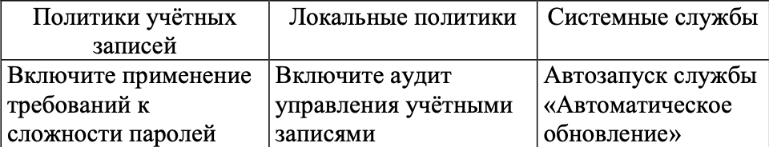

## Создание шаблона безопасности

> Шаблон безопасности можно создать используя **"Редактор локальной групповой политики"** `gpedit.msc`.

### Открытие редактора локальной групповой политики 

1) Сочетанием клавиш `Win + R` открыть диалоговое окно.

2) Ввести `gpedit.msc`.

3) Нажать `Enter`.  

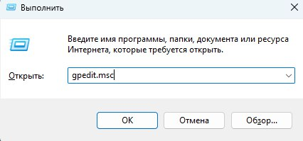  

### Настройка требования к сложности пароля

Чтобы включить требования к сложности паролей, необходимо:

1) В левой части редактора перейти по пути: **"Конфигурация компьютера"** → **"Параметры безопасности"** → **"Политики учетных записей"** → **"Политика паролей"** и найти пункт **"Пароль должен отвечать требованиям сложности"**:

  

2) Щелкнуть правой кнопкой мыши и выбрать пункт **"Свойства"**:

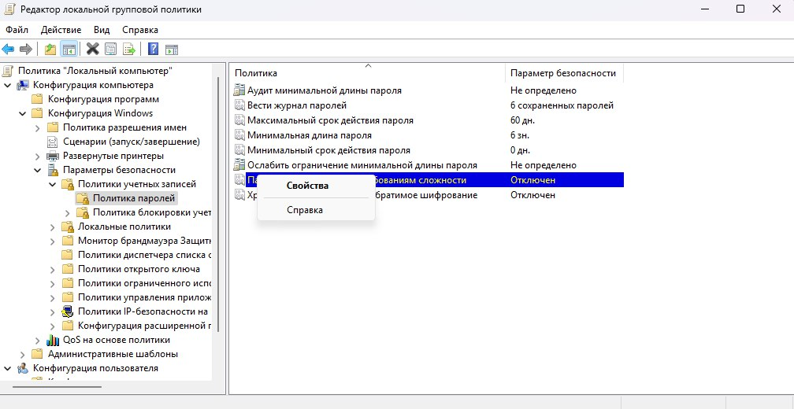  

3) В окне свойств выбрать **"Включен"**, затем нажать кнопку **"Применить"** и **"ОК"**:

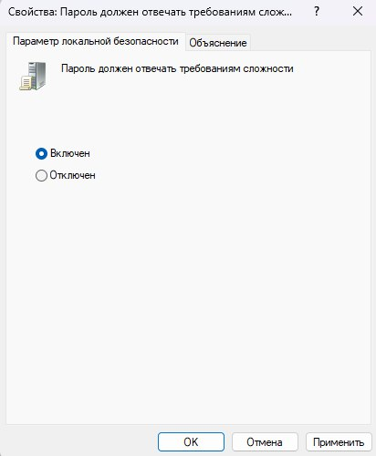  

В результате список в политике паролей должен обновиться:

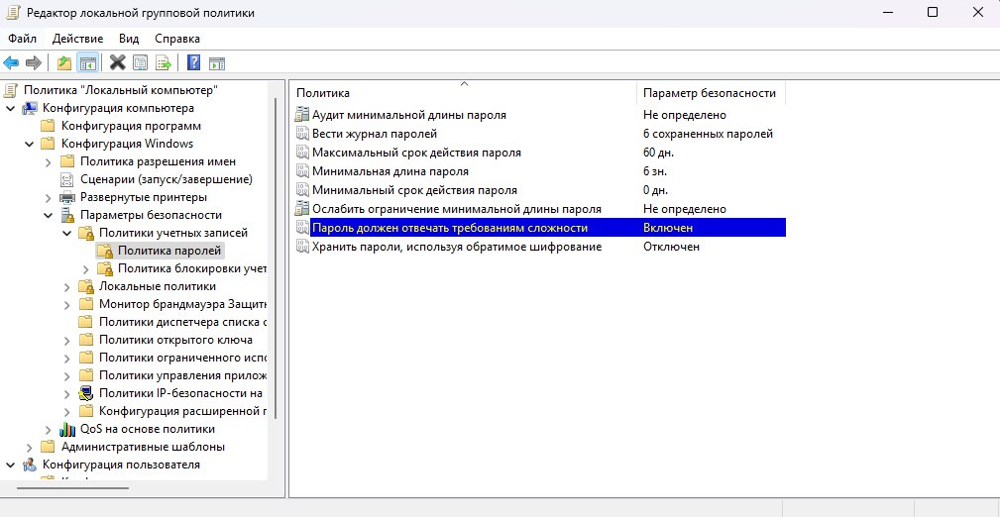  

### Включение аудита управления учётными записями

Чтобы включить аудит управления учётными записями, необходимо:

1) В левой части редактора перейти по пути: **"Конфигурация компьютера"** → **"Параметры безопасности"** → **"Локальные политики"** → **"Политика аудита"** и найти пункт **"Аудит управления учётными записями"**:

  

2) Щелкнуть правой кнопкой мыши и выбрать пункт **"Свойства"**:

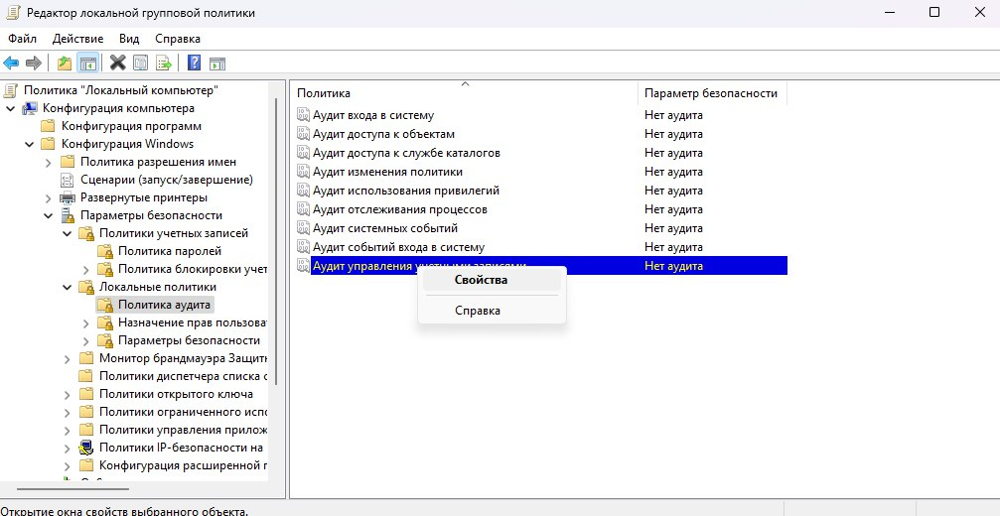 

3) В окне свойств выбрать **"Успех"** и **"Отказ"**, затем нажать кнопку **"Применить"** и **"ОК"**:

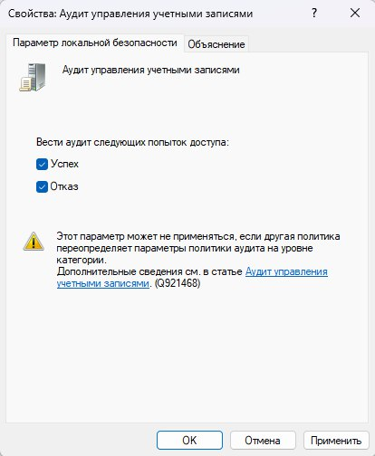  

В результате список в политике паролей должен обновиться:

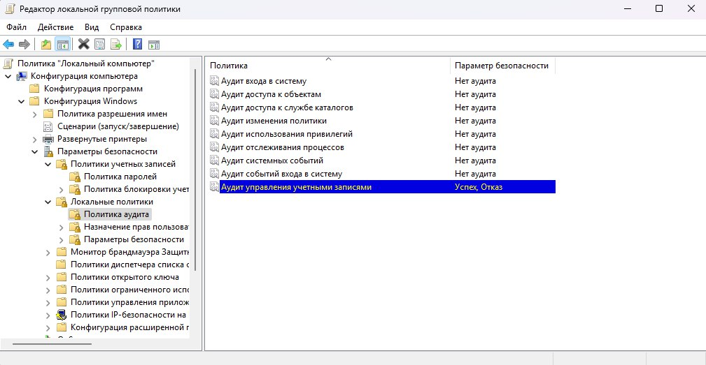  

### Настройка системных служб

Чтобы настроить системные службы, необходимо:

1) Сочетанием клавиш `Win + R` открыть диалоговое окно.

2) Ввести `services.msc`.

3) Нажать `Enter`.  

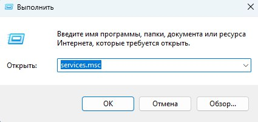

Должно открыться окно **"Службы"**:

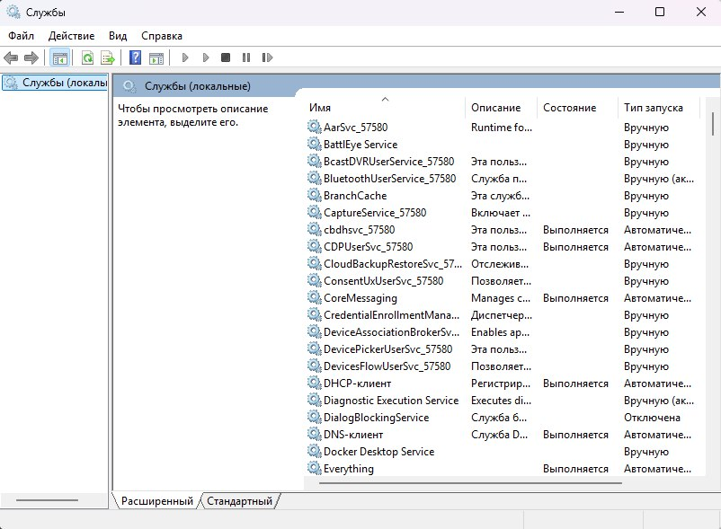

### Автозапуск службы **"Автоматическое обновление"**

Чтобы настроить автоматическое обновление Windows, необходимо:

1) В списке служб найти **"Центр обновления Windows"**:

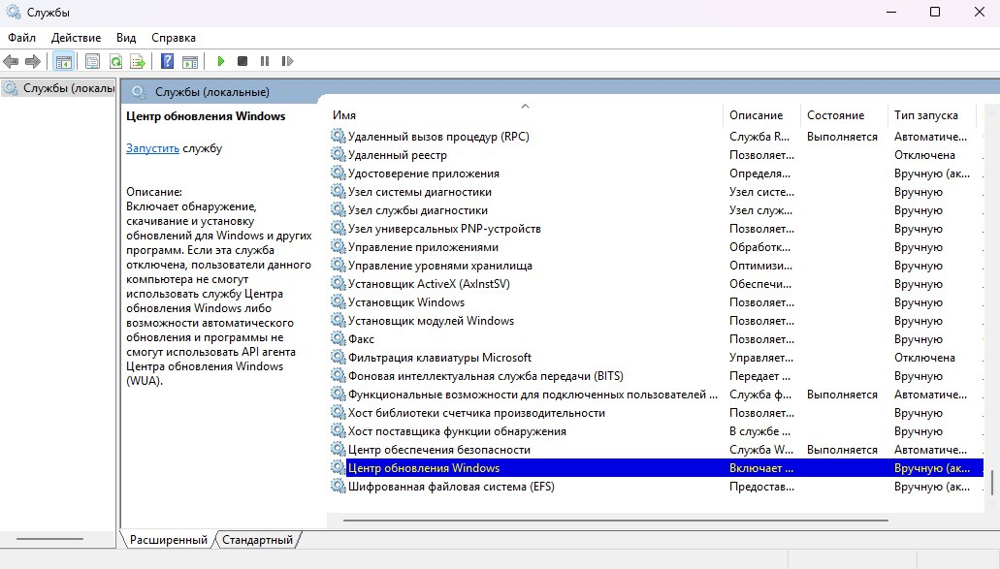

2) Щелкнуть правой кнопкой мыши и выбрать пункт **"Свойства"**.

3) В окне свойств в поле **"Тип запуска"** выбрать **"Автоматически"**, затем нажать кнопку **"Применить"** и **"ОК"**:

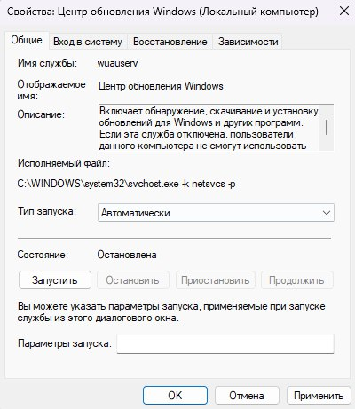 

