## Вступление

Лабораторная работа посвящена теме **"Организация комплекса средств защиты в ОС Linux"**.

### Задания 

- Установить операционную систему Linux

- Настроить управление учетными записями пользователей

- Настроить подсистемы идентификации и аутентификации

## Установка

Для установки операционной системы использовал программу **"VMware Fusion Pro"** для MacOS скачать можно [тут](https://appstorrent.ru/), либо приобрести лицензию.

Также понадобился образ **"Debian"** для ARM архитектуры процессора, скачать можно [тут](https://debian.obspm.fr/debian-cd/current/).

В качестве настроек виртуальной машины выбирал следующие: 

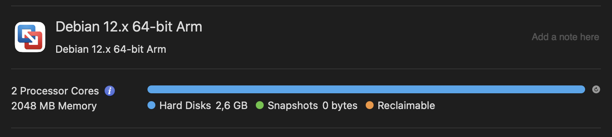

После установки необходимо авторизоваться:

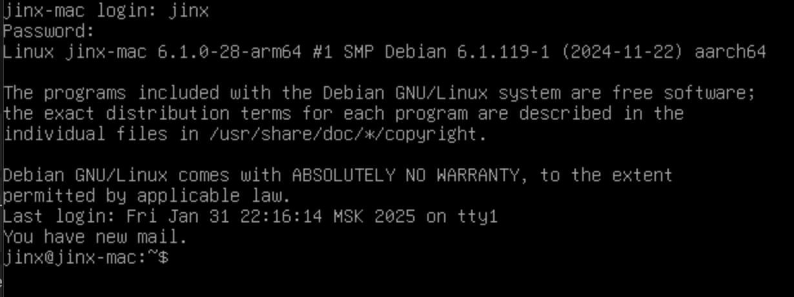

## Управление учетными записями

Для управления пользователями необходимо войти в систему через режим супер-пользователя, сделать это можно командой `su`:

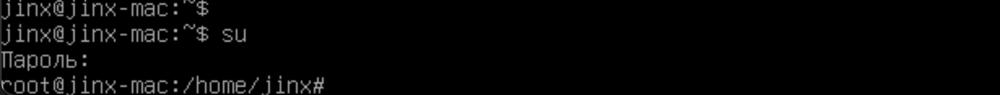

1) Создание пользователя с уникальным идентификаторм:

Создание нового пользователя выполняется командой

```bash
sudo adduser --uid 1101 user6
```

> **Примечание**: команды `sudo` можно выполнить только под именем администратора в режиме супер-пользователя. 

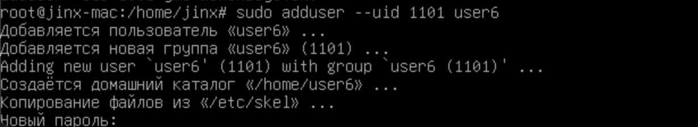

Задаем новый пароль, информацию о пользователе, можно задать, а можно пропустить, тогда значение выставится по умолчанию. После заполнения информации о пользователе, система сообщит о создании пользователя:

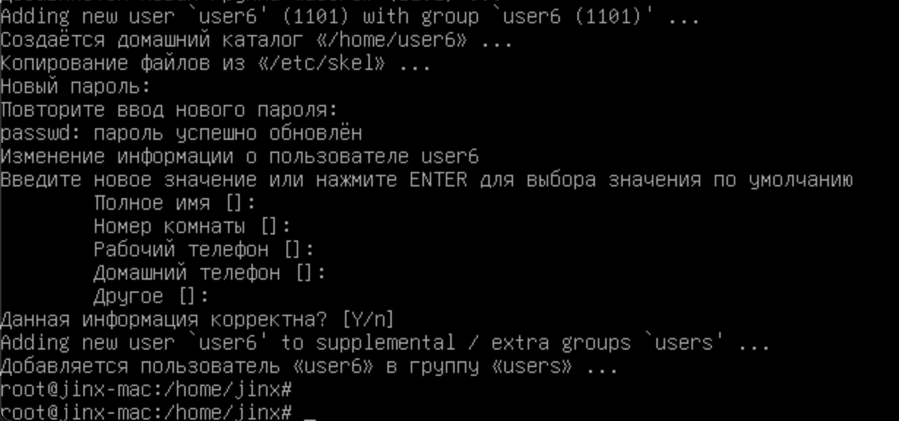

2) Создание пользователя с пустым паролем:

Создание нового пользователя без пароля выполняется командой:

```bash
sudo adduser --disabled-password user7
```

Так как пароль мы задали пустой, необходимо как и в предыдущем пункте заполнить информацию о пользователе, выставляем занчения по умолчанию:

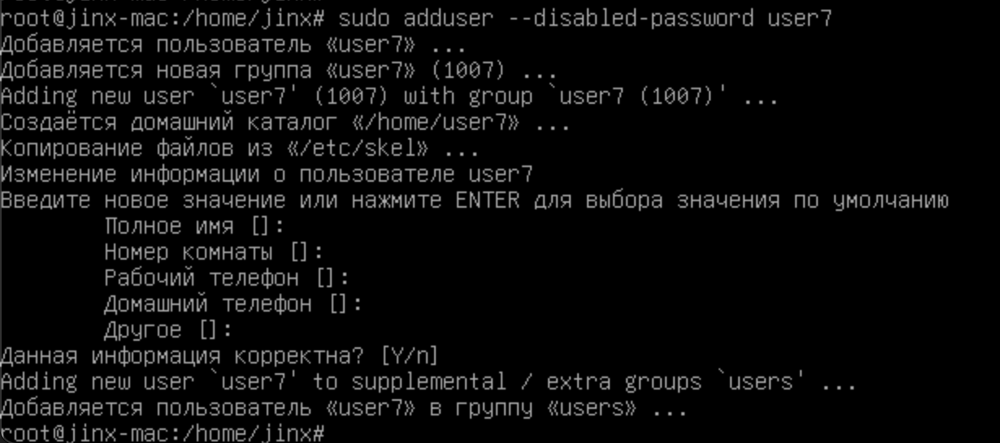

3) Создание пользователя

Создание пользователя выполняется командой:

```bash
sudo adduser user8
```

Как и в первом пункте информацию о пользователе оставляем по умолчанию, пароль необходимо добавить и повторить:

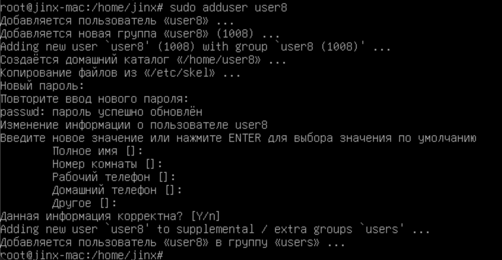

4) Создание группы и добавление в нее созданных пользователей:

Создание новой группы выполняется командой:

```bash
sudo groupadd newgroup
```

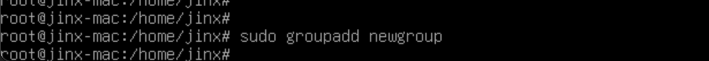

Добавление пользователей в группу выполняется командой:

```bash
sudo usermod -aG newgroup user7
sudo usermod -aG newgroup user8
```

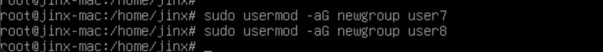

Проверить добавление пользователей в группу можно командой:

```bash
grep newgroup /etc/group
```

> `grep` выводит совпадения переданной строки, в данном случае `newgroup`, в конкретном файле, нас интересует `/etc/group`.

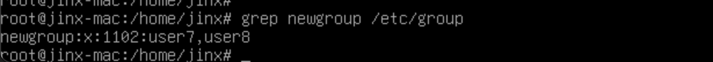

## Настройка подсистемы идентификации и аутентификации

1) Настройка требования к паролям согласно РД Гостехкомисси

Сделать это можно с помощью редактирования файла `/etc/pam.d/common-password`, добавив строки:

```bash
password requisite pam_pwquality.so retry=3 minlen=8 difok=3 

ucredit=-1 lcredit=-1 dcredit=-1 ocredit=-1 enforce_for_root
```

> Редактирование файла буду производить с помощью текстового редактора `nano`. Открыть его можно командой `nano /etc/pam.d/common-password`. Откроется вот такой редактор:
>
> 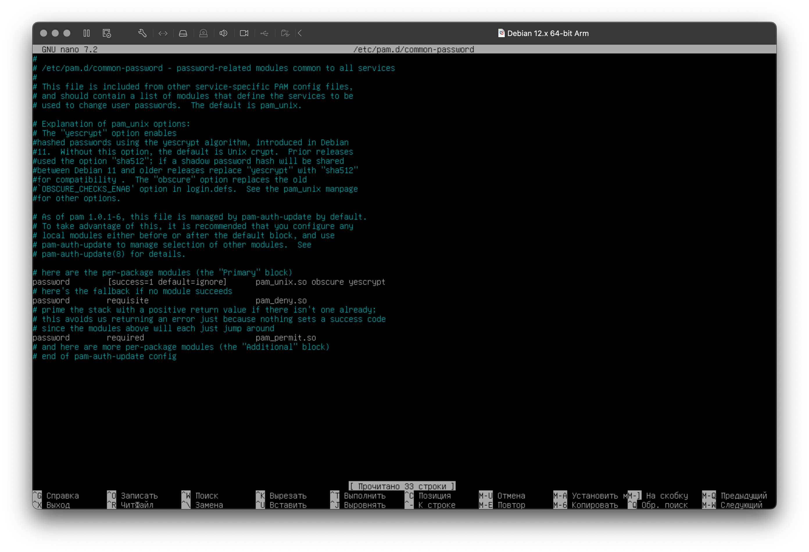
>
> Для сохранения и выхода, а также для других операций в нижней части редактора расположен список доступных команд.


Строку добавляем в соответсвующем месте, об этом нам подсказывают комментарии, оставленные разработчиками:

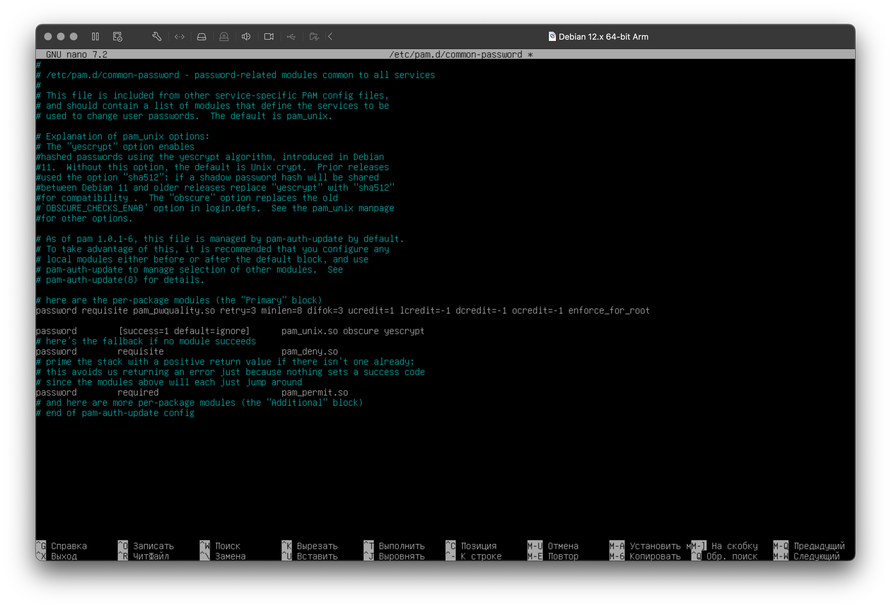

Сохраяняем изменения и выходим из редактора.

Также настройку необходимо произвести в файле `/etc/security/pwquality.conf`, добавив строки:

```bash
minlen = 8
minclass = 3
maxrepeat = 2
```

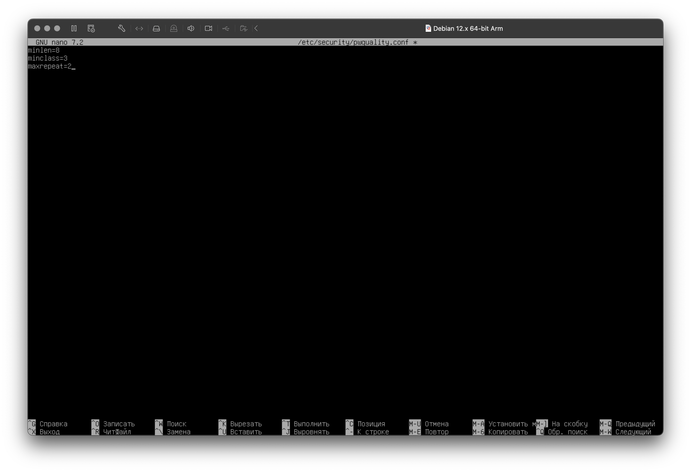

> Вообще файл не должен быть пустым, но в моем случае в файле не было ничего записано. В обычном случае все должно выглядеть примерно так:
>
> 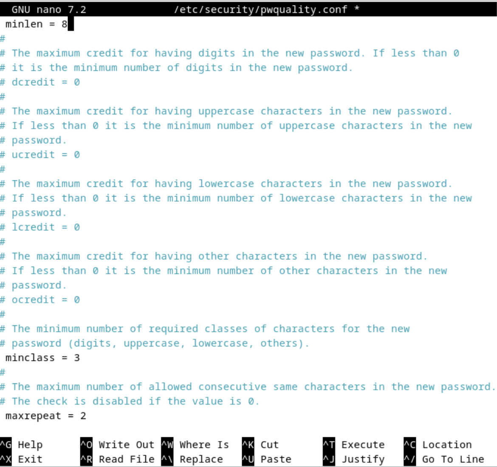
>

Сохраняем файл и выходим из редактора.

2) Настройка разграничений прав доступа

Для начала создадим файлы в папке `/tmp` для каждого пользователя, сделать это можно следующими командами:

```bash
sudo -u user6 touch /tmp/user6_file
sudo -u user7 touch /tmp/user7_file
sudo -u user8 touch /tmp/user8_file
```

> Команда `touch` позволяет создавать файлы с помощью терминала.

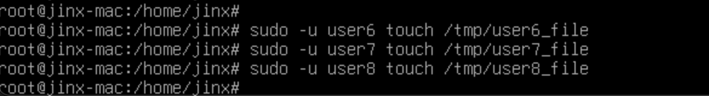

Выставим следующие права доступа:

- Для файла `user6` - чтение для `user7` и `user8`.

- Для файла `user7` - запись для `user6` и `user8`, никаких прав для `user7`.

- Для файла `user8` - полный доступ для `user6` и `user7`.

- Запрет доступа для остальных пользователей.

Осуществить это можно с помощью команд: 

```bash 
sudo chmod 640 /tmp/user6_file
sudo chown user6:newgroup /tmp/user6_file
```

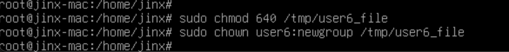

> Команда `chmod 640` устанавливает следующие права на файл:
>
> - **Владелец** — может читать и записывать (`rw-`).
>
> - **Группа** — может только читать (`r--`).
>
> - **Остальные** — не имеют доступа (`---`).

```bash 
sudo chmod 026 /tmp/user7_file
sudo chown user7:newgroup /tmp/user7_file
```


> Команда `chmod 026` устанавливает следующие права на файл:
>
> - **Владелец** - **нет прав** (`---`).
>
> - **Группа** - **только запись** (`-w-`).
>
> - **Остальные** - **только выполнение** (`--x`).

```bash 
sudo chmod 066 /tmp/user8_file
sudo chown user8:newgroup /tmp/user8_file
```

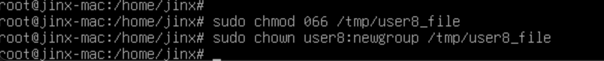

> Команда `chmod 066` устанавливает следующие права на файл:
>
> - **Владелец** - нет прав (---).
>
> - **Группа** - чтение и запись (rw-).
>
> - **Остальные** - чтение и запись (rw-).

```bash
sudo chmod o-rwx /tmp/user6_file /tmp/user7_file /tmp/user8_file
```

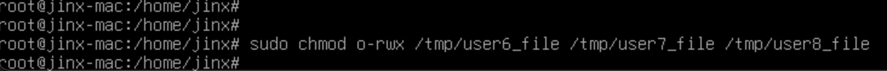

> Команда `chmod o-rwx` удаляет все права (чтение, запись и выполнение) для остальных пользователей:
> 
> - **Остальные** - нет прав (---).

Проверим результат комадами:

```bash
ls -l /tmp/user6_file
ls -l /tmp/user7_file
ls -l /tmp/user8_file
```

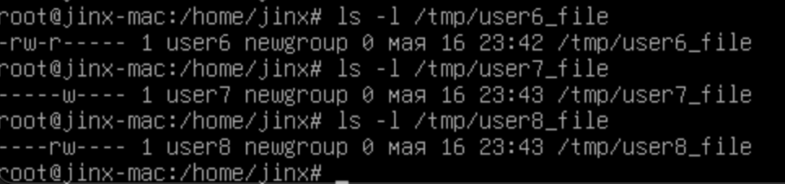

3) Настройка подсистемы регистрации и учёта событий

На моей машине не был установлен демон `syslog`, установить его можно командой:

```bash
sudo apy install rsyslog
```

Проверим его статус командой

```bash
systemctl status rsyslog
```

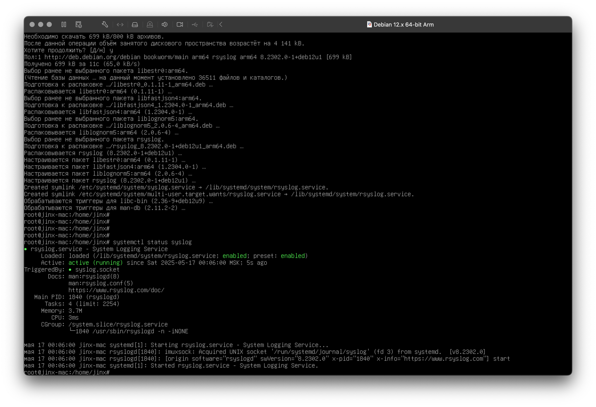

Настроим передачу регистрационной информации на удаленный сервер `(192.168.1.100)`, добавив в `/etc/rsyslog.conf`:

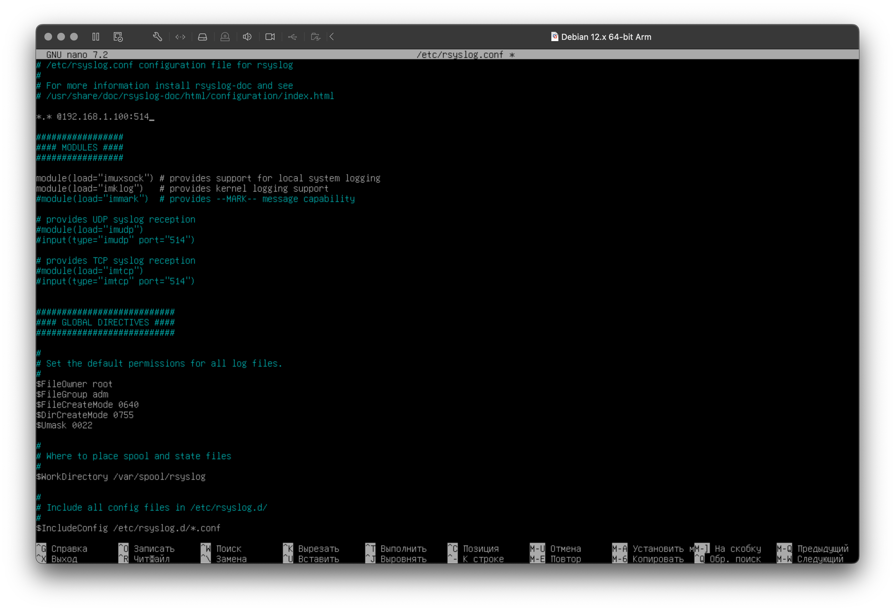

Перед настройкой вывода сообщений на экран администратора, необходимо установить `aide`, сделать это можно с помощью команды:

```bash
sudo apt install aide
```

Настроим вывод сообщений на экран пользователя `admin`, сделать это можно с помощью команды:

```bash
sudo cp /etc/aide/aide.conf /etc/aide/aidesave.conf
```

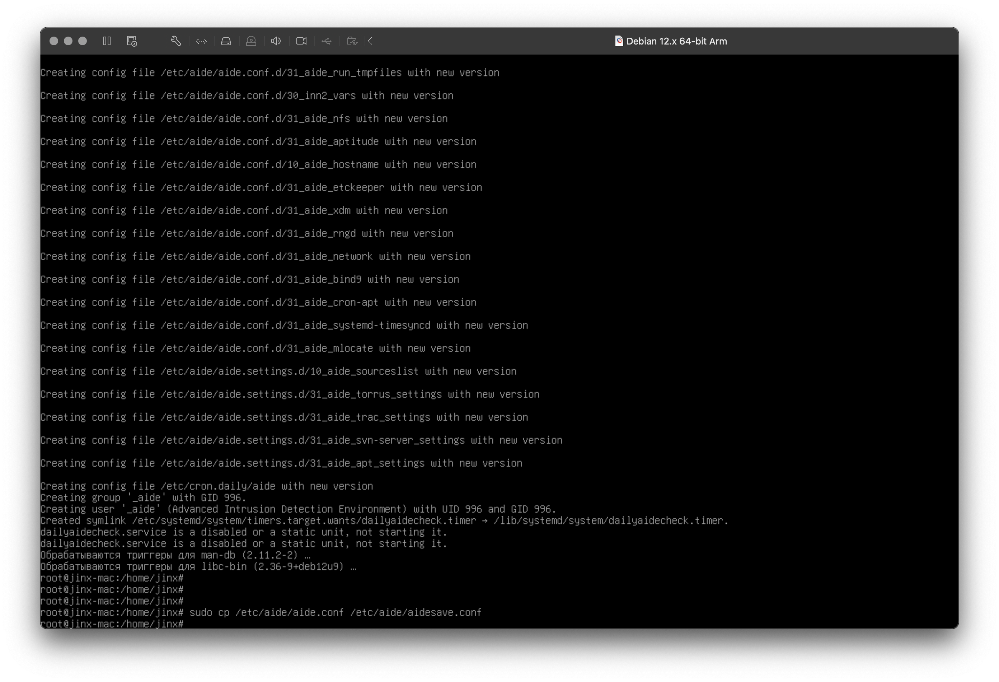

Настроим протоколирование всех событий в `/tmp/messages` и событий безопасности в `/var/log/security1`, изменив `/etc/rsyslog.d/50-default.conf`:

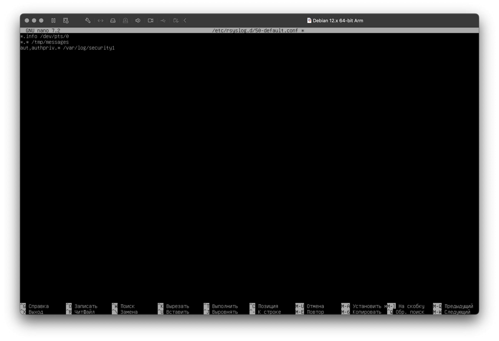

Перезапускаем `rsyslog` командой: 

```bash
sudo systemctl restart rsyslog
```

## Контроль целостности файловой системы

Скачивание `aide` было в прошлом блоке, поэтому к данному моменту установка не потребуется, напомню, сделать это можно командой:

```bash
sudo apt install aide
```

Сохраняем оригинальный конфиг и приступаем к редактированию `/etc/aide/aide.conf`: 

```bash
sudo cp /etc/aide/aide.conf /etc/aide/aide.conf.backup
sudo nano /etc/aide/aide.conf
```

Выполняем такую настройку: 

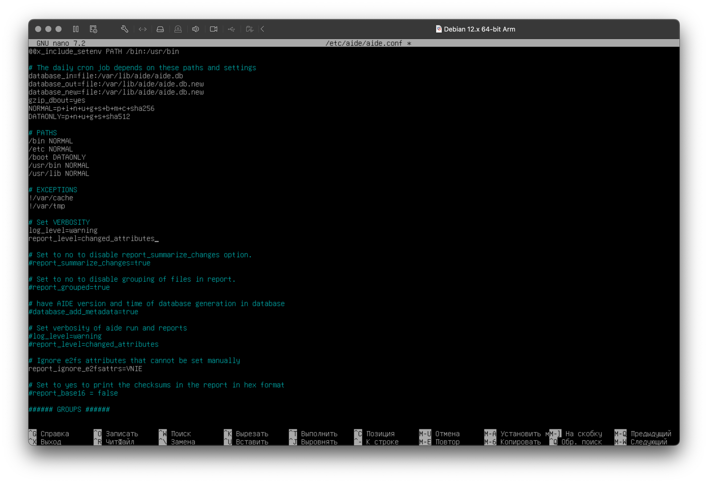

Сохраняем и выходим из редактора. 

Инициализируем командой:

```bash
sudo aideinit
```

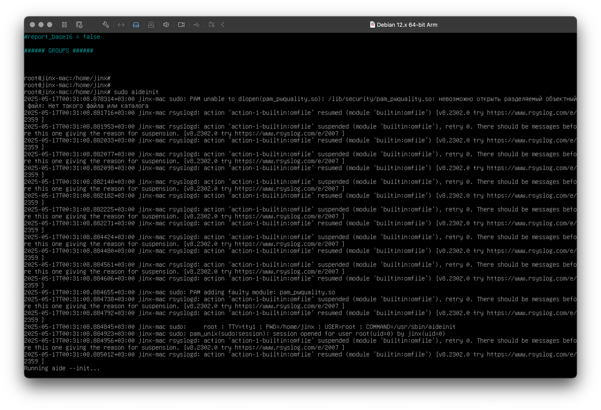


## Итоги

**Управление учётными записями**:

- Созданы пользователи с заданными параметрами: 
    - UID
    - пустой пароль
    - группы

- Изучены файлы `/etc/passwd`, `/etc/shadow`, `/etc/group` и команды:
    - `useradd`
    - `usermod`
    - `groupadd`

- Настроены политики паролей через **PAM**:
    - длина
    - сложность
    - блокировка для `root`

**Разграничение прав доступа**: 

- Практически применены команды:
    - `chmod`
    - `chown`
    - `chgrp`
    
- Настроены права доступа к файлам для разных пользователей и групп.

- Изучены биты:
    - `SUID` 
    - `SGID`
    - `sticky bit`

**Настройка подсистемы логирования (`syslog`/`rsyslog`)**:

- Установлен и настроен `rsyslog`.

- Реализована отправка логов на удалённый сервер и фильтрация событий.

- Созданы правила для записи событий безопасности в отдельный файл `/var/log/security`.

**Контроль целостности файловой системы (`AIDE`)**:

- Установлен и настроен `AIDE` для мониторинга изменений в `/bin`, `/etc`, `/usr/bin`.

- Проведена первичная инициализация базы данных и тестовая проверка.
