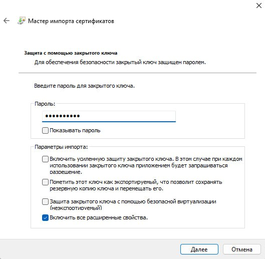

## Содержание

- [Вступление](#вступление)
- [Подготовка](#подготовка)
- [Шифрование файла](#шифрование-файла)
- [Сценарий утери сертификата](#сценарий-утери-сертификата)
- [Восстановление сертификата](#восстановление-сертификата)
- [Совместный доступ к зашифрованным файлам](#совместный-доступ-к-зашифрованным-файлам)

## Вступление 

Лабораторная работа посвящена теме: **"Шифрованная файловая система Windows"** 

## Подготовка

Перед началом работы необходимо создать 2 текстовых файла: `Файл1.txt` и `Файл2.txt`:

Для этого создал новую папку `test` и создал там 2 файла:

## Шифрование файла

Приступим к шифрованию первого файла `Файл1.txt`, для этого необходимо: 

1) Щёлкнув правой кнопкой мыши по файлу открыть **"Свойства"**

2) В разделе **"Атрибуты"** нажать на кнопку **"Другие"**

3) В появившемся окне установить "галочку" для пункта **"Шифровать содержимое данных"** и нажать кнопку **"Ок"**, затем **"Применить"**

4) В окне с предупреждением выбираем **"Зашифровать только файл"**, затем **"Ок"**

После выполнения всех манипуляций в папке для файла `Файл1.txt` появится иконка замка:

Далее необходимо создать резервную копию сертификата:

1) Сочетанием клавиш `Win` + `R` открыть диалоговое окно.

2) Ввести `certmgr.msc`.

3) Нажать `Enter`.

Откроется новое окно для управления сертификатами: 

4) В открывшемся окне выбрать **"Личное"**, затем **"Сертификаты"**.

Находим сертификат с назанчением **"Шифрующая файловая система"** и щелкаем по нему правой кнопкой мыши → **"Все задачи"** → **"Экспорт"**

Сама процедура экспорта подробно описана [тут](https://github.com/a1unade/Cybersecurity/tree/main/3#%D1%8D%D0%BA%D1%81%D0%BF%D0%BE%D1%80%D1%82-%D1%81%D0%B5%D1%80%D1%82%D0%B8%D1%84%D0%B8%D0%BA%D0%B0%D1%82%D0%B0-microsoft).

Во время экспорта необходимо выбрать опцию **"Экспортировать сертификат и ключ"**, а также установить пароль.

Проверим работоспособность, *для этого необходимо сменить пользователя*:

> Для файла `Файл2.txt` процедура аналогична, подробно описывать ее не буду, покажу только результат:
>
> 

## Сценарий утери сертификата

Для сценария утери сертификата, удалил его через утилиту `certmgr.msc`: 

Проверим работоспособность, за автора невозможно открыть файл:

## Восстановление сертификата

Пробуем восстановить сертификат с помощью импорта резервной копии:

1) Правой кнопкой мыши кликаем по свободному месту → **"Все задачи"** → **"Импорт"**

2) Откроется **"Мастер импорта серитфикатов"**, с помощью кнопки **"Обзор"** находим резервную копию и нажимаем **"Далее"**:

3) Вводим пароль в соответствующее окно и нажимаем **"Далее"**:

4) Добавляем сертификат в Личное хранилище: 

Сертификат появился в списке: 

Теперь можно редактировать файл:

## Совместный доступ к зашифрованным файлам

Для этого сценария необходимо перейти на другого пользователя и экспортировать сертификат без закрытого ключа.

После экспортирования необходимо сменить пользователя и импортировать сертификат, как это было [тут](#восстановление-сертификата).

Далее через свойства файла добавляем доступ для нашего пользователя:

Теперь второй пользователь тоже может открывать файл:

