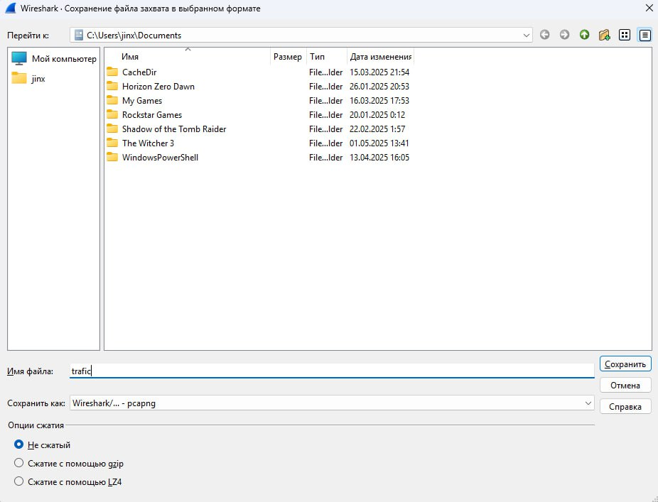

## Содержание 

- [Вступление](#вступление)
- [Захват сетевого трафика](#захват-сетевого-трафика)
- [Анализ сетевого трафика](#анализ-сетевого-трафика)
    - [Поиск ARP заголовков](#поиск-arp-заголовков)
    - [Поиск TCP заголовков](#поиск-tcp-заголовков)
    - [Поиск HTTP заголовков](#поиск-http-заголовков)
    - [Поиск ICMP заголовков](#поиск-icmp-заголовков)
    - [Поиск DNS заголовков](#поиск-dns-заголовков)
    - [Поиск UDP заголовков](#поиск-udp-заголовков)
- [Итоги](#итоги)

## Вступление 

Перед началом работы необходимо установить `Wireshark`, сделать это можно с [официального сайта](https://www.wireshark.org/download.html).

Дополнительно необходимо установить `WinPcap/Npcap` для захвата сетевого трафика.

## Захват сетевого трафика

На стартовом экране программы `Wireshark` есть несколько опций для захвата сетевого трафика, я буду делать захват для `Ethernet`:

После посещения различных сайто, можно остановить захват сетевого трафика, нажав на кнопку в левом верхнем углу окна (иконка красного квадрата).

Далее необходимо сохранить записанный трафик для последующего анализа: 

## Анализ сетевого трафика

Перед анализом сетевого трафика необходимо открыть ранее записанный файл, сделать это можно в меню **"Файл"** → **"Открыть"**:

### Поиск ARP заголовков

С помощью строки поиска находим заголовки с `ARP` протоколом, используется он для сопоставления IP-адресов с физическими MAC-адресами в локальной сети:

Посмотрим заголовки запроса: 

> В самом запросе можно увидеть роутер в виде `Sender MAC address` - TPLink

### Поиск TCP заголовков

С помощью строки поиска находим заголовки с `TCP` протоколом, используется для передачи данных между устройствами в сети:

Выбрал TCP-пакет с установленным флагом `SYN` (начало TCP-сессии):

Структура такая же как и в документе с лабораторной работой. 
С запросом в документе по значениям отличается: `source port`, `destination port`, `window size`.

### Поиск HTTP заголовков

С помощью строки поиска находим заголовки с `HTTP` протоколом, используется для передачи данных, в основном для обмена гипертекстовыми документами между веб-серверами и браузерами:

Раскроем параматер `Hypertext Transfer Protocol`(HTTP):

Это запрос на получение gif-файла, понять это можно по параметру `Content-Type` - image/gif. Структура такая же как и в документе с лабораторной работой, версия `HTTP` - 1.1.

### Поиск ICMP заголовков

С помощью строки поиска находим заголовки с `ICMP` протоколом, используется для обмена диагностическими сообщениями и сообщениями об ошибках:

Запросов для исследования с таким протоколом не нашлось. 

### Поиск DNS заголовков

С помощью строки поиска находим заголовки с `DNS` протоколом, используется для сопостваления IP-адресов с доменными именами, понятными человеку (например, www.example.com вместо привычного IP-адреса):

Структура такая же как и в документе с лабораторной работой. По значениям различия только в `Transaction Id`, `Src port`, по параметру `Queries` можно увидеть, что это был запрос для официального сайта **Microsoft**: **www.microsoft.com**.

### Поиск UDP заголовков

С помощью строки поиска находим заголовки с `UDP` протоколом, используется передачи данных в сети, в отличие от `TCP` является более быстрым, но менее надежным:

Раскроем заголовки запроса:

Структура такая же как и в документе с лабораторной работой.

По значениям отличаются порты, длина ответа, `stream index`.

## Итоги

В ходе лабораторной работы:

- Установил и освоил базовые функции `Wireshark` - мощного инструмента для анализа сетевого трафика.

- Исследовал структуру заголовков основных сетевых протоколов: `ARP`, `TCP`, `HTTP`, `ICMP`, `DNS` и `UDP`.

- На практике увидел различия между протоколами транспортного уровня (`TCP` и `UDP`).

- Убедился, что каждый протокол имеет свою специфическую структуру заголовка, предназначенную для решения конкретных задач.

- Освоил методы фильтрации пакетов в `Wireshark` для анализа конкретных типов трафика.
