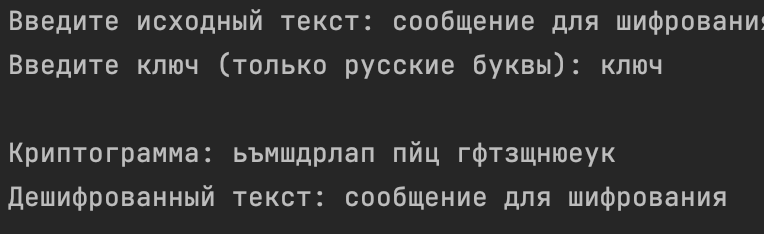
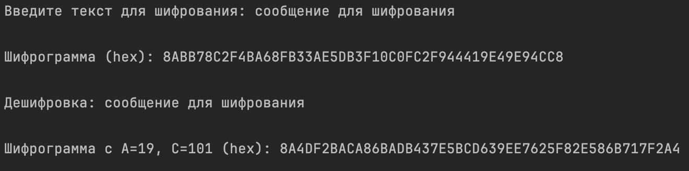
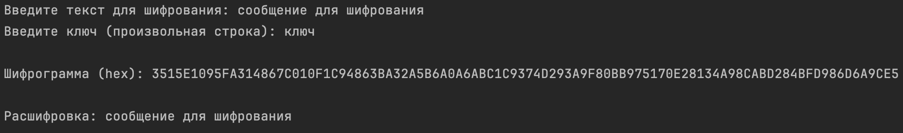
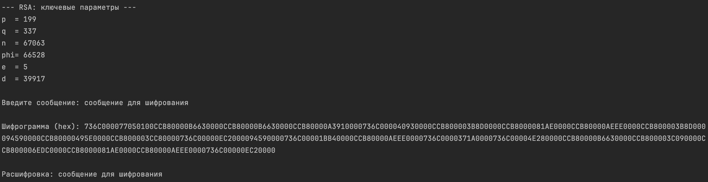
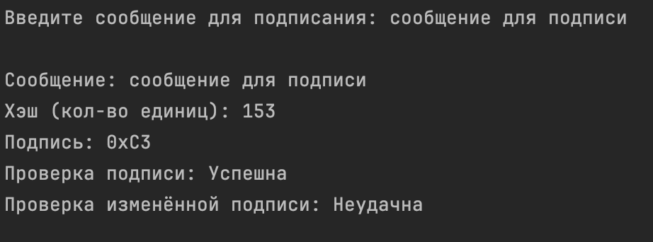
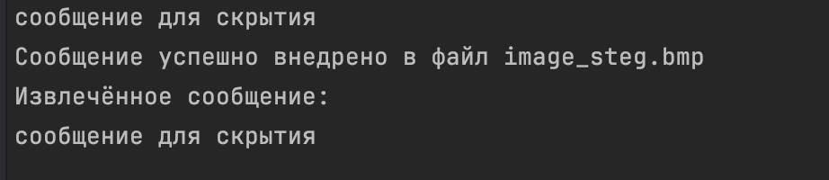
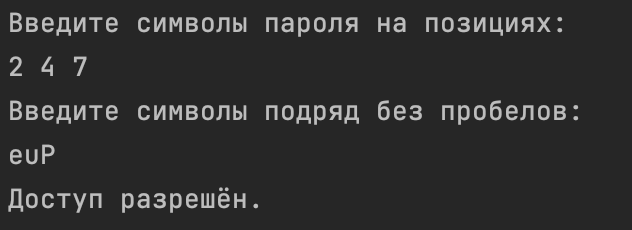
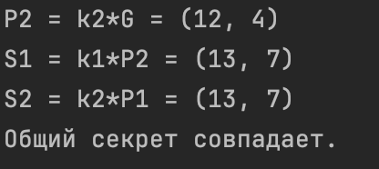

## Содержание

- [Вступление](#вступление)

- [Шифрование данных методами подстановки, перестановки и полиалфавитными шифрами](#шифрование-данных-методами-подстановки-перестановки-и-полиалфавитными-шифрами)

    - [Постановка задачи](#постановка-задачи)

    - [Исходные данные](#исходные-данные)

    - [Алгоритм работы программы](#алгоритм-работы-программы)

        - [Шифрование](#шифрование)

        - [Дешифрование](#дешифрование)

    - [Программа на C#](#программа-на-c)

    - [Итоги](#итоги)

    - [Контрольные вопросы](#контрольные-вопросы)

- [Шифр гаммирования](#шифр-гаммирования)

    - [Постановка задачи](#постановка-задачи-1)

    - [Исходные данные](#исходные-данные-1)

    - [Алгоритм работы программы](#алгоритм-работы-программы-1)

        - [Генератор ПСЧ](#генератор-псч)

        - [Шифрование](#шифрование-1)

        - [Дешифрование](#дешифрование-1)

        - [Результат](#результат)
    
    - [Итоги](#итоги-1)

    - [Контрольные вопросы](#контрольные-вопросы-1)

- [Сеть Фейштеля](#сеть-фейштеля)

    - [Постановка задачи](#постановка-задачи-2)

    - [Исходные данные](#исходные-данные-2)

    - [Алгоритм работы программы](#алгоритм-работы-программы-2)

        - [Шифрование](#шифрование-2)

        - [Дешифрование](#дешифрование-2) 

        - [Результат](#результат-1)
    
    - [Итоги](#итоги-2)

    - [Контрольные вопросы](#контрольные-вопросы-2)

- [Изучение алгоритма RSA](#изучение-алгоритма-rsa)

    - [Постановка задачи](#постановка-задачи-3)

    - [Исходные данные](#исходные-данные-3)

    - [Алгоритм работы программы](#алгоритм-работы-программы-3)

        - [Генерация ключей](#генерация-ключей)

        - [Шифрование](#шифрование-3)

        - [Дешифрование](#дешифрование-3) 

        - [Результат](#результат-3)

    - [Итоги](#итоги-3)

    - [Контрольные вопросы](#контрольные-вопросы-3)

- [Создание электронной подписи в документе](#создание-электронной-подписи-в-документе)

    - [Постановка задачи](#постановка-задачи-4)

    - [Исходные данные](#исходные-данные-4)

    - [Алгоритм работы программы](#алгоритм-работы-программы-4)

        - [Хэш-функция](#хэш-функция)

        - [Создание подписи](#создание-подписи)

        - [Проверка подписи](#проверка-подписи)

        - [Результат](#результат-3)

    - [Итоги](#итоги-4)

    - [Контрольные вопросы](#контрольные-вопросы-4)

- [Защита графического файла с помощью цифрового водяного знака](#защита-графического-файла-с-помощью-цифрового-водяного-знака)

     - [Постановка задачи](#постановка-задачи-5)

     - [Исходные данные](#исходные-данные-5)

     - [Алгоритм работы программы](#алгоритм-работы-программы-5)

        - [Внедрение](#внедрение)

        - [Извлечение](#извлечение)

        - [Результат](#результат-4)

    - [Итоги](#итоги-5)

    - [Контрольные вопросы](#контрольные-вопросы-5)

- [Парольная защита](#парольная-защита)

    - [Постановка задачи](#постановка-задачи-6)

    - [Исходные данные](#исходные-данные-6)

    - [Алгоритм работы программы](#алгоритм-работы-программы-6)

        - [Проверка позиций пароля](#проверка-позиций-пароля)

        - [Результат](#результат-5)

    - [Итоги](#итоги-6)

    - [Контрольные вопросы](#контрольные-вопросы-6)

- [Реализация протокола Диффи-Хеллмана на эллиптических кривых](#реализация-протокола-диффи-хеллмана-на-эллиптических-кривых)

    - [Постановка задачи](#постановка-задачи-7)

    - [Исходные данные](#исходные-данные-7)

    - [Алгоритм работы программы](#алгоритм-работы-программы-7)

        - [Сложение точек](#сложение-точек)

        - [Умножение точки на число](#умножение-точки-на-число)

        - [Результат](#результат-6)

    - [Итоги](#итоги-7)

    - [Контрольные вопросы](#контрольные-вопросы-7)

## Вступление

Цикл лабораторных работ по дисциплине **«Защита информации»** предназначен для
изучения основных разделов криптографии: симметричного и асимметричного шифрования,
алгоритмов электронной цифровой подписи, криптографических протоколов.

Решения заданий приведены для 6 варианта. 

> Реализация на `C#` для лабораторных работ находится в папке [**code**](./code): `[номер_лабораторной_работы].cs`.

## Шифрование данных методами подстановки, перестановки и полиалфавитными шифрами

**Тема:** Реализация многоалфавитного шифра (Виженера) на языке C#

## Постановка задачи

Изучив теоретические основы симметричных методов шифрования, перешел к выполнению практического задания.

**Цель:**  
Реализация на языке программирования `C#` многоалфавитного шифра на основе русского алфавита, обеспечивающего шифрование и дешифрование произвольного текста.

**Задачи:**  
- Реализовать шифрование текста методом многоалфавитной подстановки (алгоритм Виженера);  

- Обеспечить обратное преобразование (дешифровку) криптограммы;  

- Корректно обрабатывать русский алфавит (включая букву "Ё") и знаки препинания;  

- Сохранить регистр символов и игнорировать все неалфавитные знаки при шифровании.

## Исходные данные

- **Алфавит:** 33 буквы русского алфавита (включая "Ё")

- **Пример текста:** `ОСНОВЫ ЗАЩИТЫ ИНФОРМАЦИИ`

- **Ключ:** `КРИПТО`

- **Язык:** C#

- **Метод:** Многоалфавитный шифр (Виженера)

## Алгоритм работы программы

### Шифрование

1. Привести текст и ключ к верхнему регистру (регистр восстанавливается позже).

2. Для каждой буквы открытого текста определить её позицию в алфавите.

3. Сложить эту позицию с позицией соответствующей буквы ключа (по модулю 33).

4. Полученный символ вставить в результат, сохраняя исходный регистр.

5. Пропустить все неалфавитные символы (пробелы, знаки препинания) без изменений.

### Дешифрование

1. Для каждого символа криптограммы вычесть из его позиции в алфавите позицию буквы ключа (по модулю 33).

2. Сформировать исходный символ и восстановить регистр.

3. Неалфавитные символы остаются без изменений.

## Программа на C#

Реализация представлена на языке C# с использованием `System.Text` и консольного ввода/вывода. Пользователь вводит текст и ключ, программа выводит криптограмму и затем выполняет обратную дешифровку.

Код: 

```csharp
public static string Encrypt(string text, string key)
{
    if (string.IsNullOrEmpty(key))
        throw new ArgumentException("Key must not be empty.");

    var sb = new StringBuilder(text.Length);
    int keyPos = 0;

    foreach (char ch in text)
    {
        sb.Append(ApplyCipher(ch, key[keyPos % key.Length], true));
        if (IsRussianLetter(ch)) keyPos++;
    }

    return sb.ToString();
}
```

```csharp
public static string Decrypt(string text, string key)
{
    if (string.IsNullOrEmpty(key))
        throw new ArgumentException("Key must not be empty.");

    var sb = new StringBuilder(text.Length);
    int keyPos = 0;

    foreach (char ch in text)
    {
        sb.Append(ApplyCipher(ch, key[keyPos % key.Length], false));
        if (IsRussianLetter(ch)) keyPos++;
    }

    return sb.ToString();
}
```

Результат: 



## Итоги

В ходе выполнения лабораторной работы была разработана и протестирована программа на языке `C#`, реализующая **многоалфавитный шифр** (алгоритм Виженера) для **русского алфавита**. Программа успешно выполняет как шифрование, так и дешифрование текста, поддерживая корректную обработку регистра и игнорируя неалфавитные символы.

Цель лабораторной работы достигнута:  

- Алгоритм реализован  

- Криптограмма получена  

- Исходный текст восстановлен  

## Контрольные вопросы 

1. **Почему метод подстановки имеет слабую надежность?**  

   Метод подстановки заменяет символы фиксированными соответствиями, что облегчает криптоанализ через частотный анализ, так как частоты символов сохраняются и легко выявляются.

2. **Что такое частотный анализ?**  

   Частотный анализ — это метод криптоанализа, основанный на изучении частоты появления символов или групп символов в зашифрованном тексте для выявления закономерностей и восстановления исходного текста.

3. **Что является криптографическим ключом в методе перестановки?**  

   Криптографическим ключом в методе перестановки является порядок перестановки символов в блоке или всей последовательности текста.

4. **Как связаны метод подстановки и многоалфавитные шифры?**  

   Многоалфавитные шифры используют несколько таблиц подстановок (алфавитов), переключаясь между ними для повышения устойчивости к частотному анализу, что является развитием метода подстановки.

5. **В чем отличие криптографии от криптоанализа?**  

   Криптография — это наука и практика создания методов защиты информации, а криптоанализ — наука и практика взлома и анализа защищённых сообщений для выявления их содержания без знания ключа.

6. **По какому признаку шифры делят на симметричные и асимметричные?**  

   Шифры делятся по способу использования ключей:  

   - **Симметричные** используют один и тот же ключ для шифрования и расшифрования.  

   - **Асимметричные** используют пару ключей — открытый для шифрования и закрытый для расшифрования.

## Шифр гаммирования  

## Постановка задачи

Изучив теорию генераторов псевдослучайных чисел (ПСЧ) и методов симметричного шифрования, необходимо:

1. Выбрать параметры генератора ПСЧ `A`, `C`, `T0`, `b`

2. Разработать программу шифрования/дешифрования текста. 

3. Получить шифрограмму, выполнить обратное преобразование и сравнить с исходным текстом.  

4. Изменить один/несколько параметров генератора, повторить шифрование и сравнить результат.  

5. Оформить результаты в виде отчёта.

**Метод:** гаммирование с обратной связью (CFB‑style). 

**Число разрядов:** `b = 8` (модуль `2^b = 256`). 

**Язык:** C#.

## Исходные данные

| Параметр | Значение |
|----------|----------------------|
| `A`      | 17 |
| `C`      | 43 |
| `T0`     | 123 |
| `b`      | 8 |

- **Алфавит:** любой символ Windows‑1251 (русский текст + знаки).  

- **Тестовый текст:** `ОСНОВЫ ЗАЩИТЫ ИНФОРМАЦИИ`

## Алгоритм работы программы

### Генератор ПСЧ  

Применяется линейный конгруэнтный генератор (ЛКГ) c обратной связью

### Шифрование

Код: 

```csharp
public static byte[] Encrypt(byte[] data, int A, int C, byte T0)
{
    int state = T0;
    byte[] result = new byte[data.Length];

    for (int i = 0; i < data.Length; i++)
    {
        byte gamma = (byte)state;
        byte cipher = (byte)(data[i] ^ gamma);
        result[i] = cipher;
        
        state = (A * cipher + C) % M;
    }
    return result;
}
```

### Дешифрование

Код: 

```csharp
public static byte[] Decrypt(byte[] cipher, int A, int C, byte T0)
{
    int state = T0;
    byte[] result = new byte[cipher.Length];

    for (int i = 0; i < cipher.Length; i++)
    {
        byte gamma = (byte)state;
        byte plain = (byte)(cipher[i] ^ gamma);
        result[i] = plain;

        state = (A * cipher[i] + C) % M;
    }
    return result;
}
```

### Результат



## Итоги

- Реализован алгоритм гаммирования с обратной связью на `C#` с модулем 2^8.

- Программа успешно шифрует и дешифрует русский текст, восстанавливая исходные данные без потерь.

- Небольшое изменение параметров генератора приводит к совершенно иной шифрограмме, подтверждая стойкость схемы относительно подбору ключа.

- Цель работы достигнута, полученные навыки могут быть использованы для дальнейшего изучения потоковых шифров и методов криптографической защиты информации.

## Контрольные вопросы

1. **Какие параметры конгруэнтного генератора необходимо выбрать для получения максимальной длины последовательности псевдослучайных чисел?**  

   Для максимальной длины последовательности (периода) нужно выбрать:  

   - Модуль \( m \) — обычно большое число, часто степень двойки или простое число.  

   - Множитель \( a \), который удовлетворяет условиям полного периода (например, по теореме Лехмера): \( a-1 \) кратно всем простым делителям \( m \), и если \( m \) кратно 4, то \( a-1 \) тоже должно быть кратно 4.  \

   - Прибавка (сдвиг) \( c \) должна быть взаимно простой с \( m \) (если используется генератор с приращением).

2. **От чего зависит длина псевдослучайной последовательности?**  

   Длина зависит от выбора параметров генератора (модуля, множителя, сдвига) и типа генератора (линейный конгруэнтный, с обратной связью и т.д.). Правильный подбор обеспечивает максимально возможный период.

3. **Каков принцип действия генераторов с обратной связью?**  

   Принцип в том, что следующее значение последовательности формируется на основе нескольких предыдущих значений с помощью операций XOR, суммирования или других функций, обеспечивая сложную, но детерминированную последовательность.

4. **Какую операцию используют для шифрования в методе гаммирования?**  

   Для шифрования используют операцию `XOR` (исключающее ИЛИ) между открытым текстом и псевдослучайной гаммой.

5. **Каковы достоинства и недостатки метода гаммирования?**  

   **Достоинства:**  

   - Высокая скорость и простота реализации.  

   - При использовании действительно случайной или достаточно длинной псевдослучайной гаммы обеспечивает хорошую криптостойкость.  

   **Недостатки:**  

   - Уязвимость при повторном использовании гаммы (повтор ключа).

   - Требуется качественный источник случайности для генерации гаммы.

6. **Что является ключом в шифрах гаммирования?**  

   Ключом является начальное состояние генератора псевдослучайной последовательности — `seed` (зерно), из которого генерируется гамма.

## Сеть Фейштеля

## Постановка задачи

Необходимо:

1. Выбрать параметры сети Фейштеля:  

   - **Количество раундов:** 18  

   - **Образующая функция F:** арифметический сдвиг влево  

2. Разработать программу шифрования/дешифрования блоков текста, предусмотреть ввод ключа и генерацию раундовых под‑ключей.  

3. Получить шифрограмму, выполнить дешифровку и сравнить с исходным текстом.  

4. По желанию изменить параметры и проанализировать разницу. 

## Исходные данные

| Параметр | Значение |
|----------|----------|
| Размер блока | 64 бит (2 × 32) |
| Кол‑во раундов | 18 |
| F‑функция | циклический сдвиг влево на 1 |
| Алфавит / кодировка | UTF‑8 |
| Язык реализации | C# (.NET 8) |

## Алгоритм работы программы

Алгоритм реализован в виде блочного шифра, где каждый блок разбивается на две половины. В каждом из 18 раундов происходит чередование этих половин и применение образующей функции, основанной на арифметическом сдвиге влево. В процессе используется криптографический ключ, на основе которого для каждого раунда вычисляются под-ключи.

Шифрование и дешифрование работают по зеркальному принципу. После завершения всех раундов половины объединяются в итоговый блок.

Если длина текста не кратна размеру блока, производится дополнение нулями. При расшифровке это дополнение удаляется.

### Шифрование

Код: 

```csharp
private static void EncryptBlock(byte[] buffer, int offset, uint[] keys)
{
    uint L = BitConverter.ToUInt32(buffer, offset);
    uint R = BitConverter.ToUInt32(buffer, offset + 4);
    for (int i = 0; i < ROUNDS; i++)
    {
        uint temp = L ^ F(R, keys[i]);
        L = R;
        R = temp;
    }
    Array.Copy(BitConverter.GetBytes(L), 0, buffer, offset, 4);
    Array.Copy(BitConverter.GetBytes(R), 0, buffer, offset + 4, 4);
}
```

### Дешифрование

Код: 

```csharp
private static void DecryptBlock(byte[] buffer, int offset, uint[] keys)
{
    uint L = BitConverter.ToUInt32(buffer, offset);
    uint R = BitConverter.ToUInt32(buffer, offset + 4);
    for (int i = ROUNDS - 1; i >= 0; i--)
    {
        uint temp = R ^ F(L, keys[i]);
        R = L;
        L = temp;
    }
    Array.Copy(BitConverter.GetBytes(L), 0, buffer, offset, 4);
    Array.Copy(BitConverter.GetBytes(R), 0, buffer, offset + 4, 4);
}
```

### Результат



## Итоги

- Разработан и реализован блоковый шифр на основе 18‑раундовой сети Фейштеля.

- Алгоритм корректно шифрует и расшифровывает текст, восстанавливая исходные данные без потерь.

- Использование простого сдвига влево в качестве F‑функции демонстрирует логику сети, а гибкая генерация под‑ключей позволяет экспериментировать с параметрами.

- Цель работы достигнута, программа готова для дальнейших исследований (изменение F, количества раундов, режима шифрования и т.д.).

## Контрольные вопросы

1. **Какова структура классической сети Фейштеля?** 

   Классическая сеть Фейштеля представляет собой блочный шифр, где блок данных разбивается на две равные половины (левая и правая). В каждом раунде правая половина проходит через функцию `F` и комбинируется с левой половиной с помощью операции `XOR`. Затем половины меняются местами. Процесс повторяется заданное количество раундов.

2. **Что называется раундом в сети Фейштеля?**  

   **Раунд** — это одна итерация преобразования данных, включающая применение функции F к одной половине блока, комбинирование с другой половиной (обычно XOR), и обмен половинами местами.

3. **Какими свойствами обладает сеть Фейштеля?**  

   - Позволяет использовать одинаковую структуру для шифрования и дешифрования, меняя порядок раундовых ключей.  

   - Обеспечивает стойкость к различным видам криптоанализа при достаточном числе раундов.  

   - Упрощает реализацию обратимого преобразования.

4. **Каким образом используется материал ключа при шифровании?** 

   Ключ используется для генерации набора раундовых ключей, каждый из которых применяется на соответствующем раунде в функции `F` для смешивания с частью блока данных.

5. **В чем отличие процессов шифрования и дешифрования?**  

   Основное отличие — порядок применения раундовых ключей: при шифровании они используются в прямом порядке, при дешифровании — в обратном. Структура преобразований при этом одинаковая.

6. **Назовите достоинства и недостатки блочных шифров.**  

   **Достоинства:**  

   - Высокая криптографическая стойкость при правильной конструкции.  

   - Гибкость в выборе размера блока и ключа. 

   - Возможность реализации в различных режимах работы.  

   **Недостатки:**  

   - Более высокая вычислительная сложность по сравнению с потоковыми шифрами.  

   - Необходимость дополнения данных до размера блока.  

   - Возможность появления уязвимостей при неправильном выборе режима работы.

## Изучение алгоритма RSA

## Постановка задачи

1) Сгенерировать ключи RSA на основе чисел `p` и `q`.

2) Найти минимально возможное `e`, взаимно простое с φ(n).

3) Реализовать алгоритм шифрования и дешифрования для текста на русском языке.

4) Проверить корректность: зашифровать и расшифровать исходное сообщение.

5) Вывести: открытый ключ, закрытый ключ, криптограмма, результат расшифровки.

## Исходные данные

| Параметр | Значение            |
|----------|---------------------|
| p        | 199                 |
| q        | 337                 |
| n        | 67,063              |
| φ(n)     | 66,528              |
| e        | 5                   |
| d        | 39,917              |

## Алгоритм работы программы

RSA — криптографический алгоритм с открытым ключом, основанный на трудности факторизации больших чисел.

1. **Выбор простых чисел**  
   Выбираются два больших простых числа `p` и `q`.

2. **Вычисление модуля и функции Эйлера**  
   Модуль:  
   \[
   n = p \times q
   \]  
   Функция Эйлера:  
   \[
   \varphi(n) = (p - 1)(q - 1)
   \]

3. **Выбор открытой экспоненты `e`**  
   Выбирается минимальное число `e`, взаимно простое с \(\varphi(n)\), обычно \(1 < e < \varphi(n)\).

4. **Вычисление закрытой экспоненты `d`**  
   Находится число `d`, обратное к `e` по модулю \(\varphi(n)\):  
   \[
   d \times e \equiv 1 \pmod{\varphi(n)}
   \]

5. **Шифрование**  
   Сообщение \(M\) преобразуется в число \(m < n\).  
   Зашифрованный текст:  
   \[
   c = m^e \mod n
   \]

6. **Дешифрование**  
   Восстановление сообщения:  
   \[
   m = c^d \mod n
   \]

### Генерация ключей

Код: 

```csharp
BigInteger n = P * Q;                    // модуль
BigInteger phi = (P - 1) * (Q - 1);      // функция Эйлера

BigInteger e = FindMinE(phi);            // минимально возможное e
BigInteger d = ModInverse(e, phi);       // приватная экспонента
```

### Шифрование 

Код: 

```csharp
byte[] cipherBytes = new byte[msgBytes.Length * sizeof(int)]; // 4 байта на каждый символ
for (int i = 0; i < msgBytes.Length; i++)
{
    BigInteger m = msgBytes[i];
    BigInteger c = BigInteger.ModPow(m, e, n);
    int cVal = (int)c;
    Buffer.BlockCopy(BitConverter.GetBytes(cVal), 0, cipherBytes, i * 4, 4);
}

string cipherHex = BitConverter.ToString(cipherBytes).Replace("-", "");
```

### Дешифрование

Код: 

```csharp
byte[] decrypted = new byte[msgBytes.Length];
for (int i = 0; i < decrypted.Length; i++)
{
    int cVal = BitConverter.ToInt32(cipherBytes, i * 4);
    BigInteger c = cVal;
    BigInteger m = BigInteger.ModPow(c, d, n);
    decrypted[i] = (byte)m;
}

string plainBack = Encoding.UTF8.GetString(decrypted);
```

### Результат



## Итоги

- Разработана программа `RSA` на языке `C#`.

- Успешно реализованы функции генерации ключей, шифрования и дешифрования.

- Программа корректно работает с русским текстом (`UTF-8`).

- Введена проверка взаимной простоты параметров.

- Результаты соответствуют требованиям лабораторной работы.

## Контрольные вопросы

1. **Что такое однонаправленные функции?**  

   **Однонаправленная функция** — это функция, которую легко вычислить в прямом направлении, но чрезвычайно сложно обратить без дополнительной информации (например, ключа).

2. **Основные свойства однонаправленных функций с потайным ходом:**  

   - **Вычислимость**: функция быстро вычисляется в прямом направлении.  

   - **Однонаправленность**: обращение функции без знания потайного хода (секретной информации) практически невозможно.  

   - **Потайной ход** (trapdoor): наличие секретной информации, позволяющей эффективно найти обратное значение функции.

3. **Какие числа называются взаимно простыми?**  

   Два числа называются взаимно простыми, если их наибольший общий делитель (НОД) равен 1, то есть они не имеют общих делителей, кроме 1.

4. **Как реализуется программное возведение в степень для больших чисел?**  

   Обычно используется метод **"быстрого возведения в степень"** (экспоненцирование с повторным возведением в квадрат) с поэтапным взятием по модулю для эффективного вычисления больших степеней.

5. **На чем основана криптостойкость алгоритма RSA?** 

   Криптостойкость `RSA` основана на сложности факторизации больших составных чисел — произведения двух больших простых чисел, которые используются в открытом ключе.

6. **Каковы достоинства и недостатки асимметричных алгоритмов?** 

   **Достоинства:**  
   
   - Позволяют безопасно обмениваться ключами без предварительной договорённости.  

   - Обеспечивают функции цифровой подписи и аутентификации.  
   
   **Недостатки:**  

   - Меньшая скорость работы по сравнению с симметричными алгоритмами.  

   - Более высокая вычислительная нагрузка и требования к ресурсам.

## Создание электронной подписи в документе

## Постановка задачи

1) Реализовать алгоритм вычисления контрольной суммы, основанный на подсчёте количества единичных бит в битовом представлении символов сообщения.

2) Реализовать программную реализацию создания и проверки электронной цифровой подписи (**ЭЦП**) на основе вычисленной контрольной суммы.

3) Подписать текстовое сообщение.

4) Проверить корректность **ЭЦП**.

5) Внести изменения в подпись и убедиться, что она становится недействительной.

6) Оформить результаты работы в виде отчёта.

## Исходные данные

| Параметр | Значение            |
|----------|---------------------|
| Алгоритм контрольной суммы|Подсчёт количества 1 в битах символов|
| Формат подписи | Симметричное шифрование хэша (XOR с ключом)|
| Язык реализации| C# (.NET 8)|
| Кодировка     | UTF-8 |

## Алгоритм работы программы

1) Вычислить хэш сообщения, суммируя количество единичных бит в каждом символе (байте) сообщения.

2) С помощью симметричного ключа выполнить шифрование хэша (XOR с ключом) — получить подпись.

3) Для проверки подписи заново вычислить хэш сообщения, расшифровать подпись и сравнить.

4) Если подпись и хэш совпадают — подпись корректна.

5) В случае изменения подписи проверка должна показать ошибку.

### Хэш-функция

Код: 

```csharp
public static int ComputeHash(string message)
{
    byte[] bytes = Encoding.UTF8.GetBytes(message);
    int hash = 0;
    foreach (var b in bytes)
        hash += CountBits(b);
    return hash;
}
```
	
### Создание подписи

Код: 

```csharp
public static byte CreateSignature(int hash)
{
    return (byte)(hash ^ key);
}
```

### Проверка подписи

Код: 

```csharp
public static bool VerifySignature(string message, byte signature)
{
    int hash = ComputeHash(message);
    byte expectedSignature = (byte)(hash ^ key);
    return expectedSignature == signature;
}
```

## Результат



## Итоги

- Реализован алгоритм подсчёта количества единиц в битовом представлении символов строки.

- Реализован простой механизм создания и проверки **ЭЦП** на основе хэша и симметричного ключа (`XOR`).

- Подписано текстовое сообщение и успешно проверена корректность подписи.

- Внесены изменения в подпись — проверка показала, что подпись недействительна.

- Цель лабораторной работы выполнена.

## Контрольные вопросы

1. **Какие криптоалгоритмы используются для создания электронной цифровой подписи?**  

   Для создания **ЭЦП** обычно применяются асимметричные криптоалгоритмы, такие как `RSA`, `DSA`, `ECDSA`, которые используют пару ключей — открытый и закрытый.

2. **Что такое криптографическая хэш-функция, какими свойствами она должна обладать?**  

   **Криптографическая хэш-функция** — это функция, преобразующая входные данные произвольной длины в фиксированную строку (хэш).

   Она должна обладать свойствами:  
   
   - Однонаправленность (невозможность обратного восстановления данных по хэшу)  

   - Устойчивость к коллизиям (сложно найти два разных сообщения с одинаковым хэшем)  

   - Быстрота вычисления  

   - Незначительное изменение входных данных должно существенно менять хэш (эффект лавины)

3. **Как содержание сообщения влияет на электронную цифровую подпись?**  

   **ЭЦП** зависит от хэша сообщения, поэтому любое изменение содержания сообщения приведёт к изменению хэша и, соответственно, к некорректной подписи при проверке.

4. **Где используется ЭЦП?** 

   **ЭЦП** используется для обеспечения аутентичности, целостности и подтверждения авторства в электронных документах, электронной почте, программном обеспечении, финансовых транзакциях и юридически значимых коммуникациях.

5. **В каком случае электронная цифровая подпись при проверке отвергается?**  

   Подпись отвергается, если:  

   - Хэш проверяемого сообщения не совпадает с расшифрованным хэшем подписи  

   - Подпись была изменена или повреждена  

   - Используется неправильный открытый ключ для проверки.

6. **От каких угроз информации защищает ЭЦП?**  

   **ЭЦП** защищает от:  
   
   - Подделки сообщений (фальсификации) 

   - Несанкционированного изменения данных

   - Отказа отправителя от отправки сообщения (неотказуемость).

## Защита графического файла с помощью цифрового водяного знака

## Постановка задачи  

- Реализовать программу для внедрения и извлечения скрытой информации в BMP-файлах.  

- Для чётных вариантов использовать 2 младших бита (метод `LSB-R`).  

- Для нечётных вариантов использовать 1 младший бит (метод `LSB-M`).

## Исходные данные

`LSB` (Least Significant Bit) — метод внедрения данных в младшие биты пикселей изображения.  

- **LSB-R:** использование 2 младших бит для повышения ёмкости. 

- Контейнер: BMP-файл с 24-битной цветовой глубиной (`image.bmp`).

- Внедряемое сообщение — произвольный текст.

## Алгоритм работы программы  

### Внедрение  

1. Считать BMP-файл.  

2. Определить смещение начала пиксельных данных.  

3. Преобразовать сообщение в последовательность бит.  

4. Заменить младшие биты каждого байта пикселей на биты сообщения (2 бита).  

5. Сохранить изменённый BMP-файл.

Код: 

```csharp
public static void EmbedMessage(string bmpInPath, string bmpOutPath, string message, int bitsToUse)
{
    byte[] bmpBytes = File.ReadAllBytes(bmpInPath);
    byte[] msgBytes = System.Text.Encoding.UTF8.GetBytes(message);
    int offset = BitConverter.ToInt32(bmpBytes, 10); 
    int capacity = (bmpBytes.Length - offset) * bitsToUse / 8;

    if (msgBytes.Length > capacity)
        throw new Exception("Сообщение слишком большое для этого изображения.");

    byte[] data = new byte[msgBytes.Length + 1];
    Array.Copy(msgBytes, data, msgBytes.Length);
    data[data.Length - 1] = 0;

    int dataBitIndex = 0;
    for (int i = offset; i < bmpBytes.Length && dataBitIndex < data.Length * 8; i++)
    {
        for (int bit = 0; bit < bitsToUse; bit++)
        {
            int dataByteIndex = dataBitIndex / 8;
            int dataBitPos = 7 - (dataBitIndex % 8);
            int bitVal = (data[dataByteIndex] >> dataBitPos) & 1;

            bmpBytes[i] = (byte)((bmpBytes[i] & ~(1 << bit)) | (bitVal << bit));

            dataBitIndex++;
            if (dataBitIndex >= data.Length * 8) break;
        }
    }

    File.WriteAllBytes(bmpOutPath, bmpBytes);
}
```

### Извлечение  

1. Считать BMP-файл с внедрённой информацией.  

2. Считать младшие биты пикселей.  

3. Восстановить байты сообщения до встреченного терминатора (нуль-байта).  

4. Преобразовать байты в строку.

Код: 

```csharp
public static string ExtractMessage(string bmpPath, int bitsToUse)
{
    byte[] bmpBytes = File.ReadAllBytes(bmpPath);
    int offset = BitConverter.ToInt32(bmpBytes, 10);

    var messageBytes = new List<byte>();
    byte currentByte = 0;
    int bitCount = 0;

    for (int i = offset; i < bmpBytes.Length; i++)
    {
        for (int bit = 0; bit < bitsToUse; bit++)
        {
            int bitVal = (bmpBytes[i] >> bit) & 1;
            currentByte = (byte)((currentByte << 1) | bitVal);
            bitCount++;

            if (bitCount == 8)
            {
                if (currentByte == 0)
                    return System.Text.Encoding.UTF8.GetString(messageBytes.ToArray());

                messageBytes.Add(currentByte);
                currentByte = 0;
                bitCount = 0;
            }
        }
    }
    return System.Text.Encoding.UTF8.GetString(messageBytes.ToArray());
}
```

### Результат

- Сообщение успешно внедрено в BMP-файл с использованием выбранного количества младших бит.

- Извлечённое сообщение совпадает с исходным.

- Изменения в изображении визуально не заметны.




## Итоги

- Использование 2 младших бит увеличивает ёмкость внедрения, но может слегка ухудшать качество.

- Метод подходит для скрытия текстовой информации в графических файлах.

- LSB-алгоритмы эффективны для стеганографии в BMP-изображениях.

- Выбор количества младших бит зависит от задачи: баланс между ёмкостью и незаметностью.

- Практическая реализация позволяет внедрять и извлекать данные без потерь.

## Контрольные вопросы

1. **Что собой представляет стеганография?**  

Это метод скрытия информации внутри других данных так, чтобы её наличие было незаметно.

2. **Перечислите области применения стеганографических алгоритмов.**  

Защита авторских прав, передача секретных сообщений, аутентификация, цифровые водяные знаки.

3. **Каковы требования к цифровым водяным знакам?**  

- Незаметность, 

- Устойчивость к изменениям

- Возможность идентификации.

4. **В чем суть LSB-алгоритма?** 

Внедрение данных в младшие биты пикселей изображения.

5. **От чего зависит стойкость стегосистем?**  

- Алгоритм

- Объём данных

- Устойчивость к атакам

- Качество контейнера.

6. **Каковы особенности встраивания и извлечения информации из стегоконтейнера?**  

Необходим точный алгоритм, учитывается ёмкость и целостность данных.

## Парольная защита

## Постановка задачи  

- Ознакомиться с методами парольной защиты. 

- Использовать метод **«Выборка символов»**.  

- Разработать алгоритм и реализовать программу, демонстрирующую этот метод.  

- Оформить отчёт.

## Исходные данные

- Пароль для проверки: `SecurePass123`

- Позиции для проверки пароля: 2, 4, 7

## Алгоритм работы программы  

Метод основан на проверке пароля путём выборочного сравнения символов из заданных позиций.  
Вместо полной проверки всей строки пароля, система проверяет только отдельные символы в определённых местах, что повышает безопасность и усложняет подбор пароля.

1. Пользователь вводит полный пароль. 

2. Система выбирает несколько позиций символов (например, 2-й, 4-й, 7-й символы).  

3. Пользователь вводит символы, соответствующие этим позициям.  

4. Программа проверяет соответствие введённых символов с символами в пароле на выбранных позициях.  

5. Если все совпадают — доступ разрешён, иначе — отказ.

### Проверка позиций пароля

Для проверки пароля проверяется символы на позициях: 2, 4, 7

Код: 

```csharp
public static bool CheckPasswordSample(string inputSample)
{
    if (inputSample.Length != samplePositions.Length)
        return false;

    for (int i = 0; i < samplePositions.Length; i++)
    {
        if (correctPassword[samplePositions[i]] != inputSample[i])
            return false;
    }
    return true;
}
```

### Результат

- Программа принимает частичные символы пароля.

- Проверка осуществляется по выбранным позициям.

- При правильном вводе — доступ разрешается, иначе — нет.



## Итоги

- Метод выборки символов позволяет повысить безопасность, усложняя задачу злоумышленнику подобрать полный пароль, даже если он пытается перехватить частичные данные. 

- Реализация проста и эффективна для систем с требованиями дополнительной защиты.

## Контрольные вопросы

**1. При соблюдении каких условий парольная защита является эффективной?**  

- Использование сложных и уникальных паролей  

- Регулярная смена паролей  

- Защита пароля от раскрытия и перехвата  

- Ограничение числа попыток ввода  

**2. Каковы недостатки парольной защиты?**  

- Уязвимость к подбору и атакам перебором  

- Возможность утечки паролей  

- Зависимость от памяти пользователя  

- Возможность фишинга и социальной инженерии  

**3. Что такое метод рукопожатия?**  

Это криптографический протокол обмена ключами, обеспечивающий безопасное установление общего секрета между двумя сторонами.

**4. Какие операционные системы имеют встроенную парольную защиту?**  

`Windows`, `Linux`, `macOS` и большинство современных ОС имеют встроенные механизмы аутентификации с использованием паролей.

**5. Сравните методы простой парольной защиты и выборку символов.**  

- Простая защита требует ввода полного пароля, выборка символов — только некоторых позиций  

- Выборка символов усложняет перехват и подбор, так как разные позиции запрашиваются каждый раз  

- Простая защита удобнее, выборка повышает безопасность за счёт частичной проверки  

**6. Как реализуют пароли однократного использования?**  

С помощью алгоритмов генерации временных или одноразовых паролей, часто на основе токенов, SMS-кодов или приложения-генератора паролей (`OTP`).

## Реализация протокола Диффи-Хеллмана на эллиптических кривых

## Постановка задачи 

- Выбрать параметры эллиптической кривой и секретные значения из таблицы:  

  - \(a = 1\), \(b = 1\), \(p = 23\)  

  - Точка генератора \(G = (6, 4)\)  

  - Секретные ключи \(k_1 = 8\), \(k_2 = 9\)  

- Проверить, что кривая удовлетворяет уравнению Эллиптической кривой

- Реализовать алгоритм умножения точки на число и обмена ключами.

- Получить общий секрет — координаты точки, совпадающие у обоих участников.

## Исходные данные  

| Параметр      | Значение        |
|---------------|-----------------|
| \(a\)         | 1               |
| \(b\)         | 1               |
| \(p\)         | 23              |
| Точка \(G(x,y)\) | (6, 4)          |
| Секретный ключ \(k_1\) | 8               |
| Секретный ключ \(k_2\) | 9               |

## Алгоритм работы программы

Метод Диффи-Хеллмана позволяет двум сторонам получить общий секретный ключ по открытому каналу связи. Использование эллиптических кривых обеспечивает высокую криптостойкость при меньших размерах ключей. Операция основана на вычислении произведения точки генератора \(G\) на секретные числа \(k_1\) и \(k_2\) в группе точек эллиптической кривой.

1. Проверить, что точка \(G\) принадлежит эллиптической кривой по формуле

2. Реализовать операции сложения точек и умножения точки на число по правилам эллиптической группы.  

4. Обменяться этими точками между абонентами. 

5. Вычислить общий секрет

6. Проверить общий секретный ключ.

### Сложение точек

Код: 

```csharp
static Point AddPoints(Point P, Point Q)
{
    if (P.IsInfinity) return Q;
    if (Q.IsInfinity) return P;

    if (P.x == Q.x && P.y != Q.y) return Point.Infinity;

    int m;

    if (P.x == Q.x && P.y == Q.y)
    {
        int numerator = Mod(3 * P.x * P.x + a, p);
        int denominator = InverseMod(2 * P.y, p);
        m = Mod(numerator * denominator, p);
    }
    else
    {
        int numerator = Mod(Q.y - P.y, p);
        int denominator = InverseMod(Q.x - P.x, p);
        m = Mod(numerator * denominator, p);
    }

    int rx = Mod(m * m - P.x - Q.x, p);
    int ry = Mod(m * (P.x - rx) - P.y, p);

    return new Point(rx, ry);
}
```

### Умножение точки на число

Код: 

```csharp
static Point MultiplyPoint(Point P, int k)
{
    Point result = Point.Infinity;
    Point addend = P;

    while (k > 0)
    {
        if ((k & 1) == 1)
            result = AddPoints(result, addend);
        addend = AddPoints(addend, addend);
        k >>= 1;
    }
    return result;
}
```

### Результат



## Итоги 

Результаты показывают корректную работу алгоритма: обе стороны получают одинаковый общий секретный ключ, вычисленный как умножение точки генератора на произведение секретных чисел.

- Метод **Диффи-Хеллмана** с использованием эллиптических кривых успешно реализован.

- Проверка принадлежности точки кривой гарантирует корректность параметров.

- Применение операций сложения и умножения точек позволяет безопасно обмениваться ключами.

- Эллиптические кривые обеспечивают высокий уровень безопасности при компактных ключах.

## Контрольные вопросы

1. **Цель применения протокола Диффи-Хеллмана:**  

Обеспечить безопасный обмен секретным ключом по открытому каналу связи.

2. **Что представляет собой эллиптическая кривая?**  

Множество точек, удовлетворяющих уравнению  
\[
y^2 = x^3 + ax + b
\]  
над конечным полем.

3. **Какие операции определены на эллиптической кривой при использовании в криптографии?**  

Сложение точек и умножение точки на скаляр (число).

4. **Как выполнить умножение точки эллиптической кривой на число?**  

Используя двойное и сложение (double-and-add) — последовательное удвоение и суммирование точек.

5. **Как вычислить число, обратное данному по модулю?** 

С помощью расширенного алгоритма Евклида.

6. **Что является нулём эллиптической кривой?**  

Точка на бесконечности — нейтральный элемент группы точек.
